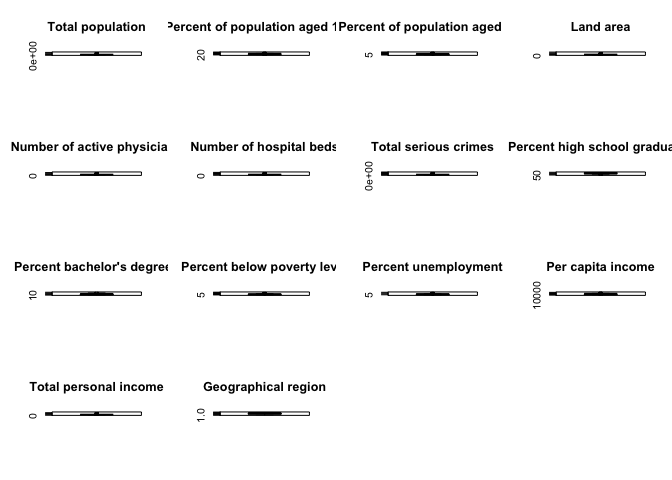

Untitled
================
Jiacheng Wu
12/6/2021

``` r
crime_df = read.csv("cdi.csv")
```

``` r
crime_df_1 = 
  dplyr::select(crime_df, -id, -cty, -state)
```

``` r
pairs(crime_df_1)
```

<!-- -->

``` r
corrplot(cor(crime_df_1), type = "upper", diag = FALSE)
```

<!-- -->

``` r
attach(crime_df_1)
par(mfrow = c(4, 4))
boxplot(crime_df_1$pop, main = "Total population")
boxplot(crime_df_1$pop18, main = "Percent of population aged 18-34")
boxplot(crime_df_1$pop65, main = "Percent of population aged 65+")
boxplot(crime_df_1$area, main = "Land area")
boxplot(crime_df_1$docs, main = "Number of active physicians")
boxplot(crime_df_1$beds, main = "Number of hospital beds")
boxplot(crime_df_1$crimes, main = "Total serious crimes")
boxplot(crime_df_1$hsgrad, main = "Percent high school graduates")
boxplot(crime_df_1$bagrad, main = "Percent bachelor's degrees")
boxplot(crime_df_1$poverty, main = "Percent below poverty level")
boxplot(crime_df_1$unemp, main = "Percent unemployment")
boxplot(crime_df_1$pcincome, main = "Per capita income")
boxplot(crime_df_1$totalinc, main = "Total personal income")
boxplot(crime_df_1$region, main = "Geographical region")

mult.fit = lm(crimes ~ ., data = crime_df_1)
summary(mult.fit)
```

    ## 
    ## Call:
    ## lm(formula = crimes ~ ., data = crime_df_1)
    ## 
    ## Residuals:
    ##    Min     1Q Median     3Q    Max 
    ## -74484  -5753    326   5069 407568 
    ## 
    ## Coefficients:
    ##               Estimate Std. Error t value Pr(>|t|)    
    ## (Intercept) -5.093e+04  3.534e+04  -1.441 0.150362    
    ## area        -3.054e+00  8.485e-01  -3.599 0.000357 ***
    ## pop          2.343e-01  2.027e-02  11.560  < 2e-16 ***
    ## pop18        2.211e+02  4.247e+02   0.521 0.602962    
    ## pop65        3.212e+01  3.806e+02   0.084 0.932790    
    ## docs        -5.189e+00  3.150e+00  -1.647 0.100229    
    ## beds         3.404e+00  2.280e+00   1.493 0.136294    
    ## hsgrad      -2.656e+02  3.218e+02  -0.825 0.409688    
    ## bagrad       1.409e+02  3.735e+02   0.377 0.706154    
    ## poverty      1.143e+03  4.881e+02   2.341 0.019693 *  
    ## unemp       -1.597e+02  6.580e+02  -0.243 0.808403    
    ## pcincome     2.335e+00  6.993e-01   3.339 0.000913 ***
    ## totalinc    -7.070e+00  9.459e-01  -7.475 4.44e-13 ***
    ## region       1.457e+03  1.319e+03   1.104 0.270214    
    ## ---
    ## Signif. codes:  0 '***' 0.001 '**' 0.01 '*' 0.05 '.' 0.1 ' ' 1
    ## 
    ## Residual standard error: 23370 on 426 degrees of freedom
    ## Multiple R-squared:  0.8438, Adjusted R-squared:  0.839 
    ## F-statistic:   177 on 13 and 426 DF,  p-value: < 2.2e-16

<!-- -->

``` r
mult.fit1 = lm(bagrad ~ ., data = crime_df_1)
summary(mult.fit1)
```

    ## 
    ## Call:
    ## lm(formula = bagrad ~ ., data = crime_df_1)
    ## 
    ## Residuals:
    ##      Min       1Q   Median       3Q      Max 
    ## -13.4132  -1.7469  -0.1196   1.6814  10.1156 
    ## 
    ## Coefficients:
    ##               Estimate Std. Error t value Pr(>|t|)    
    ## (Intercept) -5.754e+01  3.653e+00 -15.751  < 2e-16 ***
    ## area        -1.044e-04  1.116e-04  -0.935  0.35011    
    ## pop          7.266e-06  2.993e-06   2.428  0.01561 *  
    ## pop18        5.780e-01  4.745e-02  12.181  < 2e-16 ***
    ## pop65        3.738e-02  4.933e-02   0.758  0.44902    
    ## docs         1.701e-03  4.015e-04   4.236 2.79e-05 ***
    ## beds        -1.480e-03  2.877e-04  -5.144 4.11e-07 ***
    ## crimes       2.370e-06  6.283e-06   0.377  0.70615    
    ## hsgrad       4.562e-01  3.544e-02  12.870  < 2e-16 ***
    ## poverty      5.460e-01  5.796e-02   9.420  < 2e-16 ***
    ## unemp       -4.195e-01  8.289e-02  -5.060 6.24e-07 ***
    ## pcincome     1.291e-03  6.732e-05  19.171  < 2e-16 ***
    ## totalinc    -3.583e-04  1.293e-04  -2.771  0.00584 ** 
    ## region       3.293e-01  1.706e-01   1.930  0.05426 .  
    ## ---
    ## Signif. codes:  0 '***' 0.001 '**' 0.01 '*' 0.05 '.' 0.1 ' ' 1
    ## 
    ## Residual standard error: 3.031 on 426 degrees of freedom
    ## Multiple R-squared:  0.8479, Adjusted R-squared:  0.8432 
    ## F-statistic: 182.7 on 13 and 426 DF,  p-value: < 2.2e-16

``` r
step.model = stepAIC(mult.fit, direction = "both", 
                      trace = FALSE)
summary(step.model)
```

    ## 
    ## Call:
    ## lm(formula = crimes ~ area + pop + poverty + pcincome + totalinc, 
    ##     data = crime_df_1)
    ## 
    ## Residuals:
    ##    Min     1Q Median     3Q    Max 
    ## -77382  -5773    285   5117 406547 
    ## 
    ## Coefficients:
    ##               Estimate Std. Error t value Pr(>|t|)    
    ## (Intercept) -6.389e+04  1.023e+04  -6.244 1.02e-09 ***
    ## area        -3.109e+00  7.580e-01  -4.101 4.91e-05 ***
    ## pop          2.496e-01  1.633e-02  15.282  < 2e-16 ***
    ## poverty      1.450e+03  3.071e+02   4.721 3.18e-06 ***
    ## pcincome     2.460e+00  4.685e-01   5.250 2.39e-07 ***
    ## totalinc    -7.899e+00  7.870e-01 -10.037  < 2e-16 ***
    ## ---
    ## Signif. codes:  0 '***' 0.001 '**' 0.01 '*' 0.05 '.' 0.1 ' ' 1
    ## 
    ## Residual standard error: 23270 on 434 degrees of freedom
    ## Multiple R-squared:  0.8421, Adjusted R-squared:  0.8403 
    ## F-statistic: 462.9 on 5 and 434 DF,  p-value: < 2.2e-16

``` r
step_model1 = stepAIC(mult.fit, direction = "forward", 
                      trace = FALSE)

summary(step_model1)
```

    ## 
    ## Call:
    ## lm(formula = crimes ~ area + pop + pop18 + pop65 + docs + beds + 
    ##     hsgrad + bagrad + poverty + unemp + pcincome + totalinc + 
    ##     region, data = crime_df_1)
    ## 
    ## Residuals:
    ##    Min     1Q Median     3Q    Max 
    ## -74484  -5753    326   5069 407568 
    ## 
    ## Coefficients:
    ##               Estimate Std. Error t value Pr(>|t|)    
    ## (Intercept) -5.093e+04  3.534e+04  -1.441 0.150362    
    ## area        -3.054e+00  8.485e-01  -3.599 0.000357 ***
    ## pop          2.343e-01  2.027e-02  11.560  < 2e-16 ***
    ## pop18        2.211e+02  4.247e+02   0.521 0.602962    
    ## pop65        3.212e+01  3.806e+02   0.084 0.932790    
    ## docs        -5.189e+00  3.150e+00  -1.647 0.100229    
    ## beds         3.404e+00  2.280e+00   1.493 0.136294    
    ## hsgrad      -2.656e+02  3.218e+02  -0.825 0.409688    
    ## bagrad       1.409e+02  3.735e+02   0.377 0.706154    
    ## poverty      1.143e+03  4.881e+02   2.341 0.019693 *  
    ## unemp       -1.597e+02  6.580e+02  -0.243 0.808403    
    ## pcincome     2.335e+00  6.993e-01   3.339 0.000913 ***
    ## totalinc    -7.070e+00  9.459e-01  -7.475 4.44e-13 ***
    ## region       1.457e+03  1.319e+03   1.104 0.270214    
    ## ---
    ## Signif. codes:  0 '***' 0.001 '**' 0.01 '*' 0.05 '.' 0.1 ' ' 1
    ## 
    ## Residual standard error: 23370 on 426 degrees of freedom
    ## Multiple R-squared:  0.8438, Adjusted R-squared:  0.839 
    ## F-statistic:   177 on 13 and 426 DF,  p-value: < 2.2e-16

``` r
step_model2 = stepAIC(mult.fit, direction = "backward", 
                      trace = FALSE)

summary(step_model2)
```

    ## 
    ## Call:
    ## lm(formula = crimes ~ area + pop + poverty + pcincome + totalinc, 
    ##     data = crime_df_1)
    ## 
    ## Residuals:
    ##    Min     1Q Median     3Q    Max 
    ## -77382  -5773    285   5117 406547 
    ## 
    ## Coefficients:
    ##               Estimate Std. Error t value Pr(>|t|)    
    ## (Intercept) -6.389e+04  1.023e+04  -6.244 1.02e-09 ***
    ## area        -3.109e+00  7.580e-01  -4.101 4.91e-05 ***
    ## pop          2.496e-01  1.633e-02  15.282  < 2e-16 ***
    ## poverty      1.450e+03  3.071e+02   4.721 3.18e-06 ***
    ## pcincome     2.460e+00  4.685e-01   5.250 2.39e-07 ***
    ## totalinc    -7.899e+00  7.870e-01 -10.037  < 2e-16 ***
    ## ---
    ## Signif. codes:  0 '***' 0.001 '**' 0.01 '*' 0.05 '.' 0.1 ' ' 1
    ## 
    ## Residual standard error: 23270 on 434 degrees of freedom
    ## Multiple R-squared:  0.8421, Adjusted R-squared:  0.8403 
    ## F-statistic: 462.9 on 5 and 434 DF,  p-value: < 2.2e-16

## Backwards Elimination

Take out non-significant variables one at a time starting with the
highest p-value.

``` r
# No Liver
step1 = update(mult.fit, . ~ . -pop65)
summary(step1)
```

    ## 
    ## Call:
    ## lm(formula = crimes ~ area + pop + pop18 + docs + beds + hsgrad + 
    ##     bagrad + poverty + unemp + pcincome + totalinc + region, 
    ##     data = crime_df_1)
    ## 
    ## Residuals:
    ##    Min     1Q Median     3Q    Max 
    ## -74550  -5763    338   5028 407584 
    ## 
    ## Coefficients:
    ##               Estimate Std. Error t value Pr(>|t|)    
    ## (Intercept) -4.967e+04  3.202e+04  -1.551 0.121616    
    ## area        -3.048e+00  8.444e-01  -3.609 0.000343 ***
    ## pop          2.341e-01  2.004e-02  11.682  < 2e-16 ***
    ## pop18        2.034e+02  3.694e+02   0.551 0.582060    
    ## docs        -5.185e+00  3.146e+00  -1.648 0.100081    
    ## beds         3.440e+00  2.238e+00   1.537 0.125002    
    ## hsgrad      -2.690e+02  3.189e+02  -0.844 0.399392    
    ## bagrad       1.421e+02  3.728e+02   0.381 0.703332    
    ## poverty      1.137e+03  4.823e+02   2.357 0.018876 *  
    ## unemp       -1.563e+02  6.561e+02  -0.238 0.811800    
    ## pcincome     2.331e+00  6.969e-01   3.345 0.000894 ***
    ## totalinc    -7.065e+00  9.426e-01  -7.495 3.86e-13 ***
    ## region       1.447e+03  1.313e+03   1.102 0.271027    
    ## ---
    ## Signif. codes:  0 '***' 0.001 '**' 0.01 '*' 0.05 '.' 0.1 ' ' 1
    ## 
    ## Residual standard error: 23340 on 427 degrees of freedom
    ## Multiple R-squared:  0.8438, Adjusted R-squared:  0.8394 
    ## F-statistic: 192.2 on 12 and 427 DF,  p-value: < 2.2e-16

``` r
# No Alcmod
step2 = update(step1, . ~ . -unemp)
summary(step2)
```

    ## 
    ## Call:
    ## lm(formula = crimes ~ area + pop + pop18 + docs + beds + hsgrad + 
    ##     bagrad + poverty + pcincome + totalinc + region, data = crime_df_1)
    ## 
    ## Residuals:
    ##    Min     1Q Median     3Q    Max 
    ## -74676  -5858    298   5090 407679 
    ## 
    ## Coefficients:
    ##               Estimate Std. Error t value Pr(>|t|)    
    ## (Intercept) -5.129e+04  3.126e+04  -1.641 0.101595    
    ## area        -3.076e+00  8.353e-01  -3.682 0.000261 ***
    ## pop          2.336e-01  1.991e-02  11.733  < 2e-16 ***
    ## pop18        2.045e+02  3.689e+02   0.554 0.579648    
    ## docs        -5.196e+00  3.142e+00  -1.654 0.098959 .  
    ## beds         3.538e+00  2.197e+00   1.610 0.108152    
    ## hsgrad      -2.580e+02  3.152e+02  -0.819 0.413476    
    ## bagrad       1.631e+02  3.618e+02   0.451 0.652370    
    ## poverty      1.105e+03  4.626e+02   2.388 0.017381 *  
    ## pcincome     2.299e+00  6.831e-01   3.366 0.000832 ***
    ## totalinc    -7.055e+00  9.407e-01  -7.500 3.72e-13 ***
    ## region       1.506e+03  1.287e+03   1.170 0.242594    
    ## ---
    ## Signif. codes:  0 '***' 0.001 '**' 0.01 '*' 0.05 '.' 0.1 ' ' 1
    ## 
    ## Residual standard error: 23310 on 428 degrees of freedom
    ## Multiple R-squared:  0.8438, Adjusted R-squared:  0.8397 
    ## F-statistic: 210.1 on 11 and 428 DF,  p-value: < 2.2e-16

``` r
# No Age
step3 = update(step2, . ~ . -bagrad)
summary(step3)
```

    ## 
    ## Call:
    ## lm(formula = crimes ~ area + pop + pop18 + docs + beds + hsgrad + 
    ##     poverty + pcincome + totalinc + region, data = crime_df_1)
    ## 
    ## Residuals:
    ##    Min     1Q Median     3Q    Max 
    ## -74665  -5821    337   5026 407907 
    ## 
    ## Coefficients:
    ##               Estimate Std. Error t value Pr(>|t|)    
    ## (Intercept) -6.176e+04  2.090e+04  -2.955 0.003298 ** 
    ## area        -3.107e+00  8.317e-01  -3.735 0.000213 ***
    ## pop          2.347e-01  1.975e-02  11.884  < 2e-16 ***
    ## pop18        3.016e+02  2.993e+02   1.008 0.314224    
    ## docs        -4.908e+00  3.074e+00  -1.597 0.111079    
    ## beds         3.335e+00  2.149e+00   1.552 0.121411    
    ## hsgrad      -1.748e+02  2.552e+02  -0.685 0.493817    
    ## poverty      1.184e+03  4.277e+02   2.767 0.005900 ** 
    ## pcincome     2.508e+00  5.016e-01   5.000 8.35e-07 ***
    ## totalinc    -7.115e+00  9.306e-01  -7.645 1.38e-13 ***
    ## region       1.589e+03  1.273e+03   1.249 0.212474    
    ## ---
    ## Signif. codes:  0 '***' 0.001 '**' 0.01 '*' 0.05 '.' 0.1 ' ' 1
    ## 
    ## Residual standard error: 23290 on 429 degrees of freedom
    ## Multiple R-squared:  0.8437, Adjusted R-squared:   0.84 
    ## F-statistic: 231.5 on 10 and 429 DF,  p-value: < 2.2e-16

``` r
# No Gender
step4 = update(step3, . ~ . -pop18)
summary(step4)
```

    ## 
    ## Call:
    ## lm(formula = crimes ~ area + pop + docs + beds + hsgrad + poverty + 
    ##     pcincome + totalinc + region, data = crime_df_1)
    ## 
    ## Residuals:
    ##    Min     1Q Median     3Q    Max 
    ## -74945  -5815    303   5292 407696 
    ## 
    ## Coefficients:
    ##               Estimate Std. Error t value Pr(>|t|)    
    ## (Intercept) -6.023e+04  2.084e+04  -2.890 0.004054 ** 
    ## area        -3.194e+00  8.273e-01  -3.861 0.000131 ***
    ## pop          2.363e-01  1.968e-02  12.010  < 2e-16 ***
    ## docs        -4.257e+00  3.005e+00  -1.417 0.157345    
    ## beds         2.986e+00  2.121e+00   1.408 0.159928    
    ## hsgrad      -7.582e+01  2.356e+02  -0.322 0.747715    
    ## poverty      1.271e+03  4.188e+02   3.036 0.002544 ** 
    ## pcincome     2.450e+00  4.982e-01   4.917 1.25e-06 ***
    ## totalinc    -7.207e+00  9.261e-01  -7.782 5.35e-14 ***
    ## region       1.495e+03  1.269e+03   1.178 0.239543    
    ## ---
    ## Signif. codes:  0 '***' 0.001 '**' 0.01 '*' 0.05 '.' 0.1 ' ' 1
    ## 
    ## Residual standard error: 23290 on 430 degrees of freedom
    ## Multiple R-squared:  0.8433, Adjusted R-squared:   0.84 
    ## F-statistic: 257.1 on 9 and 430 DF,  p-value: < 2.2e-16

``` r
# just use one function
step(mult.fit, direction='backward')
```

    ## Start:  AIC=8865.77
    ## crimes ~ area + pop + pop18 + pop65 + docs + beds + hsgrad + 
    ##     bagrad + poverty + unemp + pcincome + totalinc + region
    ## 
    ##            Df  Sum of Sq        RSS    AIC
    ## - pop65     1 3.8881e+06 2.3261e+11 8863.8
    ## - unemp     1 3.2146e+07 2.3264e+11 8863.8
    ## - bagrad    1 7.7720e+07 2.3268e+11 8863.9
    ## - pop18     1 1.4795e+08 2.3275e+11 8864.0
    ## - hsgrad    1 3.7187e+08 2.3298e+11 8864.5
    ## - region    1 6.6550e+08 2.3327e+11 8865.0
    ## <none>                   2.3260e+11 8865.8
    ## - beds      1 1.2164e+09 2.3382e+11 8866.1
    ## - docs      1 1.4817e+09 2.3409e+11 8866.6
    ## - poverty   1 2.9923e+09 2.3560e+11 8869.4
    ## - pcincome  1 6.0893e+09 2.3869e+11 8875.1
    ## - area      1 7.0732e+09 2.3968e+11 8876.9
    ## - totalinc  1 3.0507e+10 2.6311e+11 8918.0
    ## - pop       1 7.2961e+10 3.0557e+11 8983.8
    ## 
    ## Step:  AIC=8863.77
    ## crimes ~ area + pop + pop18 + docs + beds + hsgrad + bagrad + 
    ##     poverty + unemp + pcincome + totalinc + region
    ## 
    ##            Df  Sum of Sq        RSS    AIC
    ## - unemp     1 3.0922e+07 2.3264e+11 8861.8
    ## - bagrad    1 7.9111e+07 2.3269e+11 8861.9
    ## - pop18     1 1.6527e+08 2.3277e+11 8862.1
    ## - hsgrad    1 3.8763e+08 2.3300e+11 8862.5
    ## - region    1 6.6170e+08 2.3327e+11 8863.0
    ## <none>                   2.3261e+11 8863.8
    ## - beds      1 1.2871e+09 2.3390e+11 8864.2
    ## - docs      1 1.4796e+09 2.3409e+11 8864.6
    ## - poverty   1 3.0262e+09 2.3563e+11 8867.5
    ## - pcincome  1 6.0969e+09 2.3871e+11 8873.2
    ## - area      1 7.0971e+09 2.3971e+11 8875.0
    ## - totalinc  1 3.0600e+10 2.6321e+11 8916.2
    ## - pop       1 7.4342e+10 3.0695e+11 8983.8
    ## 
    ## Step:  AIC=8861.83
    ## crimes ~ area + pop + pop18 + docs + beds + hsgrad + bagrad + 
    ##     poverty + pcincome + totalinc + region
    ## 
    ##            Df  Sum of Sq        RSS    AIC
    ## - bagrad    1 1.1046e+08 2.3275e+11 8860.0
    ## - pop18     1 1.6702e+08 2.3281e+11 8860.1
    ## - hsgrad    1 3.6423e+08 2.3300e+11 8860.5
    ## - region    1 7.4425e+08 2.3338e+11 8861.2
    ## <none>                   2.3264e+11 8861.8
    ## - beds      1 1.4088e+09 2.3405e+11 8862.5
    ## - docs      1 1.4861e+09 2.3413e+11 8862.6
    ## - poverty   1 3.0992e+09 2.3574e+11 8865.7
    ## - pcincome  1 6.1584e+09 2.3880e+11 8871.3
    ## - area      1 7.3697e+09 2.4001e+11 8873.6
    ## - totalinc  1 3.0573e+10 2.6321e+11 8914.2
    ## - pop       1 7.4823e+10 3.0746e+11 8982.5
    ## 
    ## Step:  AIC=8860.04
    ## crimes ~ area + pop + pop18 + docs + beds + hsgrad + poverty + 
    ##     pcincome + totalinc + region
    ## 
    ##            Df  Sum of Sq        RSS    AIC
    ## - hsgrad    1 2.5445e+08 2.3300e+11 8858.5
    ## - pop18     1 5.5080e+08 2.3330e+11 8859.1
    ## - region    1 8.4589e+08 2.3360e+11 8859.6
    ## <none>                   2.3275e+11 8860.0
    ## - beds      1 1.3067e+09 2.3406e+11 8860.5
    ## - docs      1 1.3831e+09 2.3413e+11 8860.6
    ## - poverty   1 4.1542e+09 2.3690e+11 8865.8
    ## - area      1 7.5698e+09 2.4032e+11 8872.1
    ## - pcincome  1 1.3566e+10 2.4632e+11 8883.0
    ## - totalinc  1 3.1712e+10 2.6446e+11 8914.2
    ## - pop       1 7.6620e+10 3.0937e+11 8983.3
    ## 
    ## Step:  AIC=8858.52
    ## crimes ~ area + pop + pop18 + docs + beds + poverty + pcincome + 
    ##     totalinc + region
    ## 
    ##            Df  Sum of Sq        RSS    AIC
    ## - pop18     1 3.5255e+08 2.3336e+11 8857.2
    ## - region    1 6.6233e+08 2.3367e+11 8857.8
    ## <none>                   2.3300e+11 8858.5
    ## - beds      1 1.3147e+09 2.3432e+11 8859.0
    ## - docs      1 1.4252e+09 2.3443e+11 8859.2
    ## - area      1 7.5866e+09 2.4059e+11 8870.6
    ## - poverty   1 7.9501e+09 2.4095e+11 8871.3
    ## - pcincome  1 1.3431e+10 2.4644e+11 8881.2
    ## - totalinc  1 3.1475e+10 2.6448e+11 8912.3
    ## - pop       1 7.6388e+10 3.0939e+11 8981.3
    ## 
    ## Step:  AIC=8857.19
    ## crimes ~ area + pop + docs + beds + poverty + pcincome + totalinc + 
    ##     region
    ## 
    ##            Df  Sum of Sq        RSS    AIC
    ## - region    1 6.9649e+08 2.3405e+11 8856.5
    ## <none>                   2.3336e+11 8857.2
    ## - beds      1 1.1192e+09 2.3448e+11 8857.3
    ## - docs      1 1.1714e+09 2.3453e+11 8857.4
    ## - poverty   1 7.8900e+09 2.4125e+11 8869.8
    ## - area      1 8.0472e+09 2.4140e+11 8870.1
    ## - pcincome  1 1.3308e+10 2.4666e+11 8879.6
    ## - totalinc  1 3.2977e+10 2.6633e+11 8913.3
    ## - pop       1 7.8411e+10 3.1177e+11 8982.6
    ## 
    ## Step:  AIC=8856.5
    ## crimes ~ area + pop + docs + beds + poverty + pcincome + totalinc
    ## 
    ##            Df  Sum of Sq        RSS    AIC
    ## - beds      1 7.8044e+08 2.3483e+11 8856.0
    ## - docs      1 9.7325e+08 2.3503e+11 8856.3
    ## <none>                   2.3405e+11 8856.5
    ## - area      1 7.3727e+09 2.4143e+11 8868.1
    ## - poverty   1 9.4412e+09 2.4349e+11 8871.9
    ## - pcincome  1 1.3301e+10 2.4735e+11 8878.8
    ## - totalinc  1 3.3807e+10 2.6786e+11 8913.9
    ## - pop       1 8.0981e+10 3.1503e+11 8985.2
    ## 
    ## Step:  AIC=8855.96
    ## crimes ~ area + pop + docs + poverty + pcincome + totalinc
    ## 
    ##            Df  Sum of Sq        RSS    AIC
    ## - docs      1 2.7324e+08 2.3511e+11 8854.5
    ## <none>                   2.3483e+11 8856.0
    ## - area      1 9.3816e+09 2.4422e+11 8871.2
    ## - poverty   1 1.1656e+10 2.4649e+11 8875.3
    ## - pcincome  1 1.5123e+10 2.4996e+11 8881.4
    ## - totalinc  1 4.9534e+10 2.8437e+11 8938.2
    ## - pop       1 1.2635e+11 3.6119e+11 9043.4
    ## 
    ## Step:  AIC=8854.47
    ## crimes ~ area + pop + poverty + pcincome + totalinc
    ## 
    ##            Df  Sum of Sq        RSS    AIC
    ## <none>                   2.3511e+11 8854.5
    ## - area      1 9.1118e+09 2.4422e+11 8869.2
    ## - poverty   1 1.2072e+10 2.4718e+11 8874.5
    ## - pcincome  1 1.4929e+10 2.5004e+11 8879.6
    ## - totalinc  1 5.4571e+10 2.8968e+11 8944.3
    ## - pop       1 1.2651e+11 3.6161e+11 9041.9

    ## 
    ## Call:
    ## lm(formula = crimes ~ area + pop + poverty + pcincome + totalinc, 
    ##     data = crime_df_1)
    ## 
    ## Coefficients:
    ## (Intercept)         area          pop      poverty     pcincome     totalinc  
    ##  -6.389e+04   -3.109e+00    2.496e-01    1.450e+03    2.460e+00   -7.899e+00

``` r
step
```

    ## function (object, scope, scale = 0, direction = c("both", "backward", 
    ##     "forward"), trace = 1, keep = NULL, steps = 1000, k = 2, 
    ##     ...) 
    ## {
    ##     mydeviance <- function(x, ...) deviance(x) %||% extractAIC(x, 
    ##         k = 0)[2L]
    ##     cut.string <- function(string) {
    ##         if (length(string) > 1L) 
    ##             string[-1L] <- paste0("\n", string[-1L])
    ##         string
    ##     }
    ##     re.arrange <- function(keep) {
    ##         namr <- names(k1 <- keep[[1L]])
    ##         namc <- names(keep)
    ##         nc <- length(keep)
    ##         nr <- length(k1)
    ##         array(unlist(keep, recursive = FALSE), c(nr, nc), list(namr, 
    ##             namc))
    ##     }
    ##     step.results <- function(models, fit, object, usingCp = FALSE) {
    ##         change <- sapply(models, "[[", "change")
    ##         rd <- sapply(models, "[[", "deviance")
    ##         dd <- c(NA, abs(diff(rd)))
    ##         rdf <- sapply(models, "[[", "df.resid")
    ##         ddf <- c(NA, diff(rdf))
    ##         AIC <- sapply(models, "[[", "AIC")
    ##         heading <- c("Stepwise Model Path \nAnalysis of Deviance Table", 
    ##             "\nInitial Model:", deparse(formula(object)), "\nFinal Model:", 
    ##             deparse(formula(fit)), "\n")
    ##         aod <- data.frame(Step = I(change), Df = ddf, Deviance = dd, 
    ##             `Resid. Df` = rdf, `Resid. Dev` = rd, AIC = AIC, 
    ##             check.names = FALSE)
    ##         if (usingCp) {
    ##             cn <- colnames(aod)
    ##             cn[cn == "AIC"] <- "Cp"
    ##             colnames(aod) <- cn
    ##         }
    ##         attr(aod, "heading") <- heading
    ##         fit$anova <- aod
    ##         fit
    ##     }
    ##     Terms <- terms(object)
    ##     object$call$formula <- object$formula <- Terms
    ##     md <- missing(direction)
    ##     direction <- match.arg(direction)
    ##     backward <- direction == "both" | direction == "backward"
    ##     forward <- direction == "both" | direction == "forward"
    ##     if (missing(scope)) {
    ##         fdrop <- numeric()
    ##         fadd <- attr(Terms, "factors")
    ##         if (md) 
    ##             forward <- FALSE
    ##     }
    ##     else {
    ##         if (is.list(scope)) {
    ##             fdrop <- if (!is.null(fdrop <- scope$lower)) 
    ##                 attr(terms(update.formula(object, fdrop)), "factors")
    ##             else numeric()
    ##             fadd <- if (!is.null(fadd <- scope$upper)) 
    ##                 attr(terms(update.formula(object, fadd)), "factors")
    ##         }
    ##         else {
    ##             fadd <- if (!is.null(fadd <- scope)) 
    ##                 attr(terms(update.formula(object, scope)), "factors")
    ##             fdrop <- numeric()
    ##         }
    ##     }
    ##     models <- vector("list", steps)
    ##     if (!is.null(keep)) 
    ##         keep.list <- vector("list", steps)
    ##     n <- nobs(object, use.fallback = TRUE)
    ##     fit <- object
    ##     bAIC <- extractAIC(fit, scale, k = k, ...)
    ##     edf <- bAIC[1L]
    ##     bAIC <- bAIC[2L]
    ##     if (is.na(bAIC)) 
    ##         stop("AIC is not defined for this model, so 'step' cannot proceed")
    ##     if (bAIC == -Inf) 
    ##         stop("AIC is -infinity for this model, so 'step' cannot proceed")
    ##     nm <- 1
    ##     if (trace) {
    ##         cat("Start:  AIC=", format(round(bAIC, 2)), "\n", cut.string(deparse(formula(fit))), 
    ##             "\n\n", sep = "")
    ##         flush.console()
    ##     }
    ##     models[[nm]] <- list(deviance = mydeviance(fit), df.resid = n - 
    ##         edf, change = "", AIC = bAIC)
    ##     if (!is.null(keep)) 
    ##         keep.list[[nm]] <- keep(fit, bAIC)
    ##     usingCp <- FALSE
    ##     while (steps > 0) {
    ##         steps <- steps - 1
    ##         AIC <- bAIC
    ##         ffac <- attr(Terms, "factors")
    ##         scope <- factor.scope(ffac, list(add = fadd, drop = fdrop))
    ##         aod <- NULL
    ##         change <- NULL
    ##         if (backward && length(scope$drop)) {
    ##             aod <- drop1(fit, scope$drop, scale = scale, trace = trace, 
    ##                 k = k, ...)
    ##             rn <- row.names(aod)
    ##             row.names(aod) <- c(rn[1L], paste("-", rn[-1L]))
    ##             if (any(aod$Df == 0, na.rm = TRUE)) {
    ##                 zdf <- aod$Df == 0 & !is.na(aod$Df)
    ##                 change <- rev(rownames(aod)[zdf])[1L]
    ##             }
    ##         }
    ##         if (is.null(change)) {
    ##             if (forward && length(scope$add)) {
    ##                 aodf <- add1(fit, scope$add, scale = scale, trace = trace, 
    ##                   k = k, ...)
    ##                 rn <- row.names(aodf)
    ##                 row.names(aodf) <- c(rn[1L], paste("+", rn[-1L]))
    ##                 aod <- if (is.null(aod)) 
    ##                   aodf
    ##                 else rbind(aod, aodf[-1, , drop = FALSE])
    ##             }
    ##             attr(aod, "heading") <- NULL
    ##             nzdf <- if (!is.null(aod$Df)) 
    ##                 aod$Df != 0 | is.na(aod$Df)
    ##             aod <- aod[nzdf, ]
    ##             if (is.null(aod) || ncol(aod) == 0) 
    ##                 break
    ##             nc <- match(c("Cp", "AIC"), names(aod))
    ##             nc <- nc[!is.na(nc)][1L]
    ##             o <- order(aod[, nc])
    ##             if (trace) 
    ##                 print(aod[o, ])
    ##             if (o[1L] == 1) 
    ##                 break
    ##             change <- rownames(aod)[o[1L]]
    ##         }
    ##         usingCp <- match("Cp", names(aod), 0L) > 0L
    ##         fit <- update(fit, paste("~ .", change), evaluate = FALSE)
    ##         fit <- eval.parent(fit)
    ##         nnew <- nobs(fit, use.fallback = TRUE)
    ##         if (all(is.finite(c(n, nnew))) && nnew != n) 
    ##             stop("number of rows in use has changed: remove missing values?")
    ##         Terms <- terms(fit)
    ##         bAIC <- extractAIC(fit, scale, k = k, ...)
    ##         edf <- bAIC[1L]
    ##         bAIC <- bAIC[2L]
    ##         if (trace) {
    ##             cat("\nStep:  AIC=", format(round(bAIC, 2)), "\n", 
    ##                 cut.string(deparse(formula(fit))), "\n\n", sep = "")
    ##             flush.console()
    ##         }
    ##         if (bAIC >= AIC + 1e-07) 
    ##             break
    ##         nm <- nm + 1
    ##         models[[nm]] <- list(deviance = mydeviance(fit), df.resid = n - 
    ##             edf, change = change, AIC = bAIC)
    ##         if (!is.null(keep)) 
    ##             keep.list[[nm]] <- keep(fit, bAIC)
    ##     }
    ##     if (!is.null(keep)) 
    ##         fit$keep <- re.arrange(keep.list[seq(nm)])
    ##     step.results(models = models[seq(nm)], fit, object, usingCp)
    ## }
    ## <bytecode: 0x117bc9728>
    ## <environment: namespace:stats>

## Forward Selection

Reversed backward elimination starting with the lowest p-value.

``` r
### Step 1:  Fit simple linear regressions for all variables,look for the variable with lowest p-value
fit1 = lm(crimes ~ pop, data = crime_df_1)
summary(fit1)
```

    ## 
    ## Call:
    ## lm(formula = crimes ~ pop, data = crime_df_1)
    ## 
    ## Residuals:
    ##    Min     1Q Median     3Q    Max 
    ## -77500  -3993    507   3518 490281 
    ## 
    ## Coefficients:
    ##               Estimate Std. Error t value Pr(>|t|)    
    ## (Intercept) -6.587e+03  1.538e+03  -4.284 2.26e-05 ***
    ## pop          8.575e-02  2.140e-03  40.059  < 2e-16 ***
    ## ---
    ## Signif. codes:  0 '***' 0.001 '**' 0.01 '*' 0.05 '.' 0.1 ' ' 1
    ## 
    ## Residual standard error: 27000 on 438 degrees of freedom
    ## Multiple R-squared:  0.7856, Adjusted R-squared:  0.7851 
    ## F-statistic:  1605 on 1 and 438 DF,  p-value: < 2.2e-16

``` r
fit2 = lm(crimes ~ totalinc, data = crime_df_1)
summary(fit2)
```

    ## 
    ## Call:
    ## lm(formula = crimes ~ totalinc, data = crime_df_1)
    ## 
    ## Residuals:
    ##     Min      1Q  Median      3Q     Max 
    ## -109333   -4346    -105    4441  536524 
    ## 
    ## Coefficients:
    ##               Estimate Std. Error t value Pr(>|t|)    
    ## (Intercept) -2876.8236  1752.0024  -1.642    0.101    
    ## totalinc        3.8108     0.1161  32.812   <2e-16 ***
    ## ---
    ## Signif. codes:  0 '***' 0.001 '**' 0.01 '*' 0.05 '.' 0.1 ' ' 1
    ## 
    ## Residual standard error: 31350 on 438 degrees of freedom
    ## Multiple R-squared:  0.7108, Adjusted R-squared:  0.7102 
    ## F-statistic:  1077 on 1 and 438 DF,  p-value: < 2.2e-16

``` r
fit3 = lm(crimes ~ area, data = crime_df_1)
summary(fit3)
```

    ## 
    ## Call:
    ## lm(formula = crimes ~ area, data = crime_df_1)
    ## 
    ## Residuals:
    ##    Min     1Q Median     3Q    Max 
    ## -57616 -20102 -14277    -66 658575 
    ## 
    ## Coefficients:
    ##              Estimate Std. Error t value Pr(>|t|)    
    ## (Intercept) 22045.184   3321.680   6.637  9.5e-11 ***
    ## area            4.865      1.780   2.733  0.00654 ** 
    ## ---
    ## Signif. codes:  0 '***' 0.001 '**' 0.01 '*' 0.05 '.' 0.1 ' ' 1
    ## 
    ## Residual standard error: 57810 on 438 degrees of freedom
    ## Multiple R-squared:  0.01676,    Adjusted R-squared:  0.01452 
    ## F-statistic: 7.468 on 1 and 438 DF,  p-value: 0.006536

``` r
fit4 = lm(crimes ~ pcincome, data = crime_df_1)
summary(fit4)
```

    ## 
    ## Call:
    ## lm(formula = crimes ~ pcincome, data = crime_df_1)
    ## 
    ## Residuals:
    ##    Min     1Q Median     3Q    Max 
    ## -49658 -18646 -13749  -2563 658073 
    ## 
    ## Coefficients:
    ##               Estimate Std. Error t value Pr(>|t|)  
    ## (Intercept) -4189.3901 12934.2035  -0.324   0.7462  
    ## pcincome        1.6863     0.6808   2.477   0.0136 *
    ## ---
    ## Signif. codes:  0 '***' 0.001 '**' 0.01 '*' 0.05 '.' 0.1 ' ' 1
    ## 
    ## Residual standard error: 57900 on 438 degrees of freedom
    ## Multiple R-squared:  0.01382,    Adjusted R-squared:  0.01156 
    ## F-statistic: 6.136 on 1 and 438 DF,  p-value: 0.01362

``` r
fit5 = lm(crimes ~ poverty, data = crime_df_1)
summary(fit5)
```

    ## 
    ## Call:
    ## lm(formula = crimes ~ poverty, data = crime_df_1)
    ## 
    ## Residuals:
    ##    Min     1Q Median     3Q    Max 
    ## -65035 -20362 -12640   1354 655904 
    ## 
    ## Coefficients:
    ##             Estimate Std. Error t value Pr(>|t|)    
    ## (Intercept)   9181.3     5825.7   1.576 0.115750    
    ## poverty       2056.1      589.4   3.488 0.000535 ***
    ## ---
    ## Signif. codes:  0 '***' 0.001 '**' 0.01 '*' 0.05 '.' 0.1 ' ' 1
    ## 
    ## Residual standard error: 57510 on 438 degrees of freedom
    ## Multiple R-squared:  0.02703,    Adjusted R-squared:  0.02481 
    ## F-statistic: 12.17 on 1 and 438 DF,  p-value: 0.0005354

``` r
fit6 = lm(crimes ~ docs, data = crime_df_1)
summary(fit6)
```

    ## 
    ## Call:
    ## lm(formula = crimes ~ docs, data = crime_df_1)
    ## 
    ## Residuals:
    ##     Min      1Q  Median      3Q     Max 
    ## -121640   -3763     533    4070  550456 
    ## 
    ## Coefficients:
    ##              Estimate Std. Error t value Pr(>|t|)    
    ## (Intercept)  734.7279  1815.6019   0.405    0.686    
    ## docs          26.6973     0.8889  30.035   <2e-16 ***
    ## ---
    ## Signif. codes:  0 '***' 0.001 '**' 0.01 '*' 0.05 '.' 0.1 ' ' 1
    ## 
    ## Residual standard error: 33330 on 438 degrees of freedom
    ## Multiple R-squared:  0.6732, Adjusted R-squared:  0.6724 
    ## F-statistic: 902.1 on 1 and 438 DF,  p-value: < 2.2e-16

``` r
fit7 = lm(crimes ~ beds, data = crime_df_1)
summary(fit7)
```

    ## 
    ## Call:
    ## lm(formula = crimes ~ beds, data = crime_df_1)
    ## 
    ## Residuals:
    ##     Min      1Q  Median      3Q     Max 
    ## -129025   -6048    1037    6087  490724 
    ## 
    ## Coefficients:
    ##               Estimate Std. Error t value Pr(>|t|)    
    ## (Intercept) -4684.9759  1699.7860  -2.756  0.00609 ** 
    ## beds           21.7990     0.6267  34.782  < 2e-16 ***
    ## ---
    ## Signif. codes:  0 '***' 0.001 '**' 0.01 '*' 0.05 '.' 0.1 ' ' 1
    ## 
    ## Residual standard error: 30060 on 438 degrees of freedom
    ## Multiple R-squared:  0.7342, Adjusted R-squared:  0.7336 
    ## F-statistic:  1210 on 1 and 438 DF,  p-value: < 2.2e-16

``` r
fit8 = lm(crimes ~ region, data = crime_df_1)
summary(fit8)
```

    ## 
    ## Call:
    ## lm(formula = crimes ~ region, data = crime_df_1)
    ## 
    ## Residuals:
    ##    Min     1Q Median     3Q    Max 
    ## -31145 -20380 -14307   -424 661370 
    ## 
    ## Coefficients:
    ##             Estimate Std. Error t value Pr(>|t|)  
    ## (Intercept)    14453       7154   2.020   0.0439 *
    ## region          5143       2680   1.919   0.0556 .
    ## ---
    ## Signif. codes:  0 '***' 0.001 '**' 0.01 '*' 0.05 '.' 0.1 ' ' 1
    ## 
    ## Residual standard error: 58060 on 438 degrees of freedom
    ## Multiple R-squared:  0.008337,   Adjusted R-squared:  0.006073 
    ## F-statistic: 3.682 on 1 and 438 DF,  p-value: 0.05564

``` r
fit9 = lm(crimes ~ hsgrad, data = crime_df_1)
summary(fit9)
```

    ## 
    ## Call:
    ## lm(formula = crimes ~ hsgrad, data = crime_df_1)
    ## 
    ## Residuals:
    ##    Min     1Q Median     3Q    Max 
    ## -41179 -20970 -14283    849 655151 
    ## 
    ## Coefficients:
    ##             Estimate Std. Error t value Pr(>|t|)   
    ## (Intercept)  95574.7    30716.1   3.112  0.00198 **
    ## hsgrad        -882.7      394.4  -2.238  0.02572 * 
    ## ---
    ## Signif. codes:  0 '***' 0.001 '**' 0.01 '*' 0.05 '.' 0.1 ' ' 1
    ## 
    ## Residual standard error: 57970 on 438 degrees of freedom
    ## Multiple R-squared:  0.01131,    Adjusted R-squared:  0.009048 
    ## F-statistic: 5.009 on 1 and 438 DF,  p-value: 0.02572

``` r
fit10 = lm(crimes ~ pop18, data = crime_df_1)
summary(fit10)
```

    ## 
    ## Call:
    ## lm(formula = crimes ~ pop18, data = crime_df_1)
    ## 
    ## Residuals:
    ##    Min     1Q Median     3Q    Max 
    ## -46990 -19565 -14140   -437 657411 
    ## 
    ## Coefficients:
    ##             Estimate Std. Error t value Pr(>|t|)  
    ## (Intercept)  -8592.5    19093.0   -0.45   0.6529  
    ## pop18         1249.8      661.3    1.89   0.0594 .
    ## ---
    ## Signif. codes:  0 '***' 0.001 '**' 0.01 '*' 0.05 '.' 0.1 ' ' 1
    ## 
    ## Residual standard error: 58070 on 438 degrees of freedom
    ## Multiple R-squared:  0.008089,   Adjusted R-squared:  0.005825 
    ## F-statistic: 3.572 on 1 and 438 DF,  p-value: 0.05942

``` r
fit11 = lm(crimes ~ bagrad, data = crime_df_1)
summary(fit11)
```

    ## 
    ## Call:
    ## lm(formula = crimes ~ bagrad, data = crime_df_1)
    ## 
    ## Residuals:
    ##    Min     1Q Median     3Q    Max 
    ## -34654 -19288 -14388  -1868 661110 
    ## 
    ## Coefficients:
    ##             Estimate Std. Error t value Pr(>|t|)  
    ## (Intercept)  14749.3     8128.0   1.815   0.0703 .
    ## bagrad         586.4      362.5   1.618   0.1064  
    ## ---
    ## Signif. codes:  0 '***' 0.001 '**' 0.01 '*' 0.05 '.' 0.1 ' ' 1
    ## 
    ## Residual standard error: 58130 on 438 degrees of freedom
    ## Multiple R-squared:  0.005941,   Adjusted R-squared:  0.003671 
    ## F-statistic: 2.618 on 1 and 438 DF,  p-value: 0.1064

``` r
fit12 = lm(crimes ~ unemp, data = crime_df_1)
summary(fit12)
```

    ## 
    ## Call:
    ## lm(formula = crimes ~ unemp, data = crime_df_1)
    ## 
    ## Residuals:
    ##    Min     1Q Median     3Q    Max 
    ## -35023 -20895 -14991   -426 660302 
    ## 
    ## Coefficients:
    ##             Estimate Std. Error t value Pr(>|t|)  
    ## (Intercept)    19954       8321   2.398   0.0169 *
    ## unemp           1085       1189   0.912   0.3620  
    ## ---
    ## Signif. codes:  0 '***' 0.001 '**' 0.01 '*' 0.05 '.' 0.1 ' ' 1
    ## 
    ## Residual standard error: 58250 on 438 degrees of freedom
    ## Multiple R-squared:  0.001897,   Adjusted R-squared:  -0.0003816 
    ## F-statistic: 0.8325 on 1 and 438 DF,  p-value: 0.362

``` r
fit13 = lm(crimes ~ pop65, data = crime_df_1)
summary(fit13)
```

    ## 
    ## Call:
    ## lm(formula = crimes ~ pop65, data = crime_df_1)
    ## 
    ## Residuals:
    ##    Min     1Q Median     3Q    Max 
    ## -28216 -20801 -15041   -634 660553 
    ## 
    ## Coefficients:
    ##             Estimate Std. Error t value Pr(>|t|)    
    ## (Intercept)  33376.0     8920.0   3.742 0.000207 ***
    ## pop65         -514.7      696.5  -0.739 0.460283    
    ## ---
    ## Signif. codes:  0 '***' 0.001 '**' 0.01 '*' 0.05 '.' 0.1 ' ' 1
    ## 
    ## Residual standard error: 58270 on 438 degrees of freedom
    ## Multiple R-squared:  0.001245,   Adjusted R-squared:  -0.001035 
    ## F-statistic: 0.5462 on 1 and 438 DF,  p-value: 0.4603

``` r
# Enter first the one with the lowest p-value: pop
forward1 = lm(crimes ~ pop, data = crime_df_1)
summary(forward1)
```

    ## 
    ## Call:
    ## lm(formula = crimes ~ pop, data = crime_df_1)
    ## 
    ## Residuals:
    ##    Min     1Q Median     3Q    Max 
    ## -77500  -3993    507   3518 490281 
    ## 
    ## Coefficients:
    ##               Estimate Std. Error t value Pr(>|t|)    
    ## (Intercept) -6.587e+03  1.538e+03  -4.284 2.26e-05 ***
    ## pop          8.575e-02  2.140e-03  40.059  < 2e-16 ***
    ## ---
    ## Signif. codes:  0 '***' 0.001 '**' 0.01 '*' 0.05 '.' 0.1 ' ' 1
    ## 
    ## Residual standard error: 27000 on 438 degrees of freedom
    ## Multiple R-squared:  0.7856, Adjusted R-squared:  0.7851 
    ## F-statistic:  1605 on 1 and 438 DF,  p-value: < 2.2e-16

``` r
### Step 2: Enter the one with the lowest p-value in the rest 
fit1 = update(forward1, . ~ . +beds)
summary(fit1)
```

    ## 
    ## Call:
    ## lm(formula = crimes ~ pop + beds, data = crime_df_1)
    ## 
    ## Residuals:
    ##    Min     1Q Median     3Q    Max 
    ## -82033  -3894    760   4108 485110 
    ## 
    ## Coefficients:
    ##               Estimate Std. Error t value Pr(>|t|)    
    ## (Intercept) -7.104e+03  1.508e+03  -4.712 3.30e-06 ***
    ## pop          6.253e-02  5.464e-03  11.444  < 2e-16 ***
    ## beds         6.609e+00  1.437e+00   4.599 5.56e-06 ***
    ## ---
    ## Signif. codes:  0 '***' 0.001 '**' 0.01 '*' 0.05 '.' 0.1 ' ' 1
    ## 
    ## Residual standard error: 26400 on 437 degrees of freedom
    ## Multiple R-squared:  0.7955, Adjusted R-squared:  0.7945 
    ## F-statistic: 849.9 on 2 and 437 DF,  p-value: < 2.2e-16

``` r
fit2 = update(forward1, . ~ . +docs)
summary(fit2)
```

    ## 
    ## Call:
    ## lm(formula = crimes ~ pop + docs, data = crime_df_1)
    ## 
    ## Residuals:
    ##    Min     1Q Median     3Q    Max 
    ## -72574  -4844    163   3586 484991 
    ## 
    ## Coefficients:
    ##               Estimate Std. Error t value Pr(>|t|)    
    ## (Intercept) -6.988e+03  1.552e+03  -4.503  8.6e-06 ***
    ## pop          9.588e-02  6.272e-03  15.285  < 2e-16 ***
    ## docs        -3.624e+00  2.110e+00  -1.718   0.0865 .  
    ## ---
    ## Signif. codes:  0 '***' 0.001 '**' 0.01 '*' 0.05 '.' 0.1 ' ' 1
    ## 
    ## Residual standard error: 26940 on 437 degrees of freedom
    ## Multiple R-squared:  0.787,  Adjusted R-squared:  0.786 
    ## F-statistic: 807.4 on 2 and 437 DF,  p-value: < 2.2e-16

``` r
fit3 = update(forward1, . ~ . +totalinc)
summary(fit3)
```

    ## 
    ## Call:
    ## lm(formula = crimes ~ pop + totalinc, data = crime_df_1)
    ## 
    ## Residuals:
    ##    Min     1Q Median     3Q    Max 
    ## -78095  -4938   -261   3177 438930 
    ## 
    ## Coefficients:
    ##               Estimate Std. Error t value Pr(>|t|)    
    ## (Intercept) -8.916e+03  1.418e+03  -6.287 7.87e-10 ***
    ## pop          1.999e-01  1.199e-02  16.672  < 2e-16 ***
    ## totalinc    -5.406e+00  5.602e-01  -9.649  < 2e-16 ***
    ## ---
    ## Signif. codes:  0 '***' 0.001 '**' 0.01 '*' 0.05 '.' 0.1 ' ' 1
    ## 
    ## Residual standard error: 24540 on 437 degrees of freedom
    ## Multiple R-squared:  0.8232, Adjusted R-squared:  0.8224 
    ## F-statistic:  1018 on 2 and 437 DF,  p-value: < 2.2e-16

``` r
fit4 = update(forward1, . ~ . +poverty)
summary(fit4)
```

    ## 
    ## Call:
    ## lm(formula = crimes ~ pop + poverty, data = crime_df_1)
    ## 
    ## Residuals:
    ##    Min     1Q Median     3Q    Max 
    ## -69616  -5380    620   4785 473554 
    ## 
    ## Coefficients:
    ##               Estimate Std. Error t value Pr(>|t|)    
    ## (Intercept) -2.067e+04  2.723e+03  -7.591 1.94e-13 ***
    ## pop          8.526e-02  2.057e-03  41.448  < 2e-16 ***
    ## poverty      1.637e+03  2.659e+02   6.156 1.69e-09 ***
    ## ---
    ## Signif. codes:  0 '***' 0.001 '**' 0.01 '*' 0.05 '.' 0.1 ' ' 1
    ## 
    ## Residual standard error: 25930 on 437 degrees of freedom
    ## Multiple R-squared:  0.8027, Adjusted R-squared:  0.8018 
    ## F-statistic: 888.9 on 2 and 437 DF,  p-value: < 2.2e-16

``` r
fit5 = update(forward1, . ~ . +area)
summary(fit5)
```

    ## 
    ## Call:
    ## lm(formula = crimes ~ pop + area, data = crime_df_1)
    ## 
    ## Residuals:
    ##    Min     1Q Median     3Q    Max 
    ## -78117  -4200    540   3926 488594 
    ## 
    ## Coefficients:
    ##               Estimate Std. Error t value Pr(>|t|)    
    ## (Intercept) -5.784e+03  1.702e+03  -3.398 0.000741 ***
    ## pop          8.616e-02  2.173e-03  39.654  < 2e-16 ***
    ## area        -9.271e-01  8.439e-01  -1.099 0.272558    
    ## ---
    ## Signif. codes:  0 '***' 0.001 '**' 0.01 '*' 0.05 '.' 0.1 ' ' 1
    ## 
    ## Residual standard error: 26990 on 437 degrees of freedom
    ## Multiple R-squared:  0.7862, Adjusted R-squared:  0.7852 
    ## F-statistic: 803.4 on 2 and 437 DF,  p-value: < 2.2e-16

``` r
fit6 = update(forward1, . ~ . +pcincome)
summary(fit6)
```

    ## 
    ## Call:
    ## lm(formula = crimes ~ pop + pcincome, data = crime_df_1)
    ## 
    ## Residuals:
    ##    Min     1Q Median     3Q    Max 
    ## -80030  -4888  -1194   2941 483640 
    ## 
    ## Coefficients:
    ##               Estimate Std. Error t value Pr(>|t|)    
    ## (Intercept)  1.829e+04  5.938e+03   3.080   0.0022 ** 
    ## pop          8.795e-02  2.159e-03  40.733  < 2e-16 ***
    ## pcincome    -1.387e+00  3.202e-01  -4.331 1.84e-05 ***
    ## ---
    ## Signif. codes:  0 '***' 0.001 '**' 0.01 '*' 0.05 '.' 0.1 ' ' 1
    ## 
    ## Residual standard error: 26470 on 437 degrees of freedom
    ## Multiple R-squared:  0.7944, Adjusted R-squared:  0.7935 
    ## F-statistic: 844.3 on 2 and 437 DF,  p-value: < 2.2e-16

``` r
fit7 = update(forward1, . ~ . +hsgrad)
summary(fit7)
```

    ## 
    ## Call:
    ## lm(formula = crimes ~ pop + hsgrad, data = crime_df_1)
    ## 
    ## Residuals:
    ##    Min     1Q Median     3Q    Max 
    ## -72260  -5217    326   4908 480113 
    ## 
    ## Coefficients:
    ##               Estimate Std. Error t value Pr(>|t|)    
    ## (Intercept)  5.201e+04  1.408e+04   3.693  0.00025 ***
    ## pop          8.559e-02  2.102e-03  40.729  < 2e-16 ***
    ## hsgrad      -7.547e+02  1.803e+02  -4.185 3.45e-05 ***
    ## ---
    ## Signif. codes:  0 '***' 0.001 '**' 0.01 '*' 0.05 '.' 0.1 ' ' 1
    ## 
    ## Residual standard error: 26500 on 437 degrees of freedom
    ## Multiple R-squared:  0.7938, Adjusted R-squared:  0.7929 
    ## F-statistic: 841.4 on 2 and 437 DF,  p-value: < 2.2e-16

``` r
fit8 = update(forward1, . ~ . +region) #0.0556
summary(fit8)
```

    ## 
    ## Call:
    ## lm(formula = crimes ~ pop + region, data = crime_df_1)
    ## 
    ## Residuals:
    ##    Min     1Q Median     3Q    Max 
    ## -74837  -3714    426   3272 493126 
    ## 
    ## Coefficients:
    ##               Estimate Std. Error t value Pr(>|t|)    
    ## (Intercept) -1.065e+04  3.382e+03   -3.15  0.00174 ** 
    ## pop          8.554e-02  2.144e-03   39.91  < 2e-16 ***
    ## region       1.684e+03  1.248e+03    1.35  0.17781    
    ## ---
    ## Signif. codes:  0 '***' 0.001 '**' 0.01 '*' 0.05 '.' 0.1 ' ' 1
    ## 
    ## Residual standard error: 26970 on 437 degrees of freedom
    ## Multiple R-squared:  0.7865, Adjusted R-squared:  0.7855 
    ## F-statistic: 804.8 on 2 and 437 DF,  p-value: < 2.2e-16

``` r
fit9 = update(forward1, . ~ . +pop18)  # 0.0594
summary(fit9)
```

    ## 
    ## Call:
    ## lm(formula = crimes ~ pop + pop18, data = crime_df_1)
    ## 
    ## Residuals:
    ##    Min     1Q Median     3Q    Max 
    ## -78240  -4010    193   3870 490656 
    ## 
    ## Coefficients:
    ##               Estimate Std. Error t value Pr(>|t|)    
    ## (Intercept) -1.471e+04  8.880e+03  -1.656   0.0984 .  
    ## pop          8.559e-02  2.147e-03  39.857   <2e-16 ***
    ## pop18        2.863e+02  3.084e+02   0.928   0.3538    
    ## ---
    ## Signif. codes:  0 '***' 0.001 '**' 0.01 '*' 0.05 '.' 0.1 ' ' 1
    ## 
    ## Residual standard error: 27000 on 437 degrees of freedom
    ## Multiple R-squared:  0.786,  Adjusted R-squared:  0.785 
    ## F-statistic: 802.6 on 2 and 437 DF,  p-value: < 2.2e-16

``` r
fit10 = update(forward1, . ~ . +bagrad) # 0.1064
summary(fit10)
```

    ## 
    ## Call:
    ## lm(formula = crimes ~ pop + bagrad, data = crime_df_1)
    ## 
    ## Residuals:
    ##    Min     1Q Median     3Q    Max 
    ## -72368  -4204   -374   3635 486964 
    ## 
    ## Coefficients:
    ##               Estimate Std. Error t value Pr(>|t|)    
    ## (Intercept)  1.806e+03  3.768e+03   0.479   0.6319    
    ## pop          8.652e-02  2.152e-03  40.206   <2e-16 ***
    ## bagrad      -4.125e+02  1.692e+02  -2.438   0.0152 *  
    ## ---
    ## Signif. codes:  0 '***' 0.001 '**' 0.01 '*' 0.05 '.' 0.1 ' ' 1
    ## 
    ## Residual standard error: 26850 on 437 degrees of freedom
    ## Multiple R-squared:  0.7885, Adjusted R-squared:  0.7875 
    ## F-statistic: 814.4 on 2 and 437 DF,  p-value: < 2.2e-16

``` r
fit11 = update(forward1, . ~ . +unemp) # 0.3620
summary(fit11)
```

    ## 
    ## Call:
    ## lm(formula = crimes ~ pop + unemp, data = crime_df_1)
    ## 
    ## Residuals:
    ##    Min     1Q Median     3Q    Max 
    ## -78160  -4444    354   4255 487513 
    ## 
    ## Coefficients:
    ##               Estimate Std. Error t value Pr(>|t|)    
    ## (Intercept) -1.296e+04  3.934e+03  -3.294  0.00107 ** 
    ## pop          8.573e-02  2.135e-03  40.145  < 2e-16 ***
    ## unemp        9.669e+02  5.498e+02   1.758  0.07937 .  
    ## ---
    ## Signif. codes:  0 '***' 0.001 '**' 0.01 '*' 0.05 '.' 0.1 ' ' 1
    ## 
    ## Residual standard error: 26930 on 437 degrees of freedom
    ## Multiple R-squared:  0.7871, Adjusted R-squared:  0.7861 
    ## F-statistic: 807.8 on 2 and 437 DF,  p-value: < 2.2e-16

``` r
fit12 = update(forward1, . ~ . +pop65) # 0.4603
summary(fit12)
```

    ## 
    ## Call:
    ## lm(formula = crimes ~ pop + pop65, data = crime_df_1)
    ## 
    ## Residuals:
    ##    Min     1Q Median     3Q    Max 
    ## -77427  -4123    500   3709 490365 
    ## 
    ## Coefficients:
    ##               Estimate Std. Error t value Pr(>|t|)    
    ## (Intercept) -4.880e+03  4.246e+03  -1.149    0.251    
    ## pop          8.572e-02  2.143e-03  39.993   <2e-16 ***
    ## pop65       -1.395e+02  3.232e+02  -0.432    0.666    
    ## ---
    ## Signif. codes:  0 '***' 0.001 '**' 0.01 '*' 0.05 '.' 0.1 ' ' 1
    ## 
    ## Residual standard error: 27020 on 437 degrees of freedom
    ## Multiple R-squared:  0.7857, Adjusted R-squared:  0.7847 
    ## F-statistic:   801 on 2 and 437 DF,  p-value: < 2.2e-16

``` r
# Enter the one with the lowest p-value: totalinc
forward2 = update(forward1, . ~ . + totalinc)
summary(forward2)
```

    ## 
    ## Call:
    ## lm(formula = crimes ~ pop + totalinc, data = crime_df_1)
    ## 
    ## Residuals:
    ##    Min     1Q Median     3Q    Max 
    ## -78095  -4938   -261   3177 438930 
    ## 
    ## Coefficients:
    ##               Estimate Std. Error t value Pr(>|t|)    
    ## (Intercept) -8.916e+03  1.418e+03  -6.287 7.87e-10 ***
    ## pop          1.999e-01  1.199e-02  16.672  < 2e-16 ***
    ## totalinc    -5.406e+00  5.602e-01  -9.649  < 2e-16 ***
    ## ---
    ## Signif. codes:  0 '***' 0.001 '**' 0.01 '*' 0.05 '.' 0.1 ' ' 1
    ## 
    ## Residual standard error: 24540 on 437 degrees of freedom
    ## Multiple R-squared:  0.8232, Adjusted R-squared:  0.8224 
    ## F-statistic:  1018 on 2 and 437 DF,  p-value: < 2.2e-16

``` r
### Step 3: Enter the one with the lowest p-value in the rest 
fit1 = update(forward2, . ~ . +poverty)
summary(fit1)
```

    ## 
    ## Call:
    ## lm(formula = crimes ~ pop + totalinc + poverty, data = crime_df_1)
    ## 
    ## Residuals:
    ##    Min     1Q Median     3Q    Max 
    ## -76663  -4948   -234   3608 438755 
    ## 
    ## Coefficients:
    ##               Estimate Std. Error t value Pr(>|t|)    
    ## (Intercept) -1.410e+04  2.712e+03  -5.199 3.09e-07 ***
    ## pop          1.857e-01  1.352e-02  13.729  < 2e-16 ***
    ## totalinc    -4.741e+00  6.319e-01  -7.502 3.57e-13 ***
    ## poverty      6.354e+02  2.839e+02   2.238   0.0257 *  
    ## ---
    ## Signif. codes:  0 '***' 0.001 '**' 0.01 '*' 0.05 '.' 0.1 ' ' 1
    ## 
    ## Residual standard error: 24430 on 436 degrees of freedom
    ## Multiple R-squared:  0.8252, Adjusted R-squared:  0.824 
    ## F-statistic: 686.3 on 3 and 436 DF,  p-value: < 2.2e-16

``` r
fit2 = update(forward2, . ~ . +beds)
summary(fit2)
```

    ## 
    ## Call:
    ## lm(formula = crimes ~ pop + totalinc + beds, data = crime_df_1)
    ## 
    ## Residuals:
    ##    Min     1Q Median     3Q    Max 
    ## -76687  -4366     50   3051 438084 
    ## 
    ## Coefficients:
    ##               Estimate Std. Error t value Pr(>|t|)    
    ## (Intercept) -9.158e+03  1.401e+03  -6.535 1.78e-10 ***
    ## pop          1.768e-01  1.349e-02  13.104  < 2e-16 ***
    ## totalinc    -5.102e+00  5.593e-01  -9.122  < 2e-16 ***
    ## beds         4.762e+00  1.334e+00   3.570 0.000396 ***
    ## ---
    ## Signif. codes:  0 '***' 0.001 '**' 0.01 '*' 0.05 '.' 0.1 ' ' 1
    ## 
    ## Residual standard error: 24220 on 436 degrees of freedom
    ## Multiple R-squared:  0.8283, Adjusted R-squared:  0.8271 
    ## F-statistic: 700.9 on 3 and 436 DF,  p-value: < 2.2e-16

``` r
fit3 = update(forward2, . ~ . +pcincome)
summary(fit3)
```

    ## 
    ## Call:
    ## lm(formula = crimes ~ pop + totalinc + pcincome, data = crime_df_1)
    ## 
    ## Residuals:
    ##    Min     1Q Median     3Q    Max 
    ## -73117  -5636    486   4292 426359 
    ## 
    ## Coefficients:
    ##               Estimate Std. Error t value Pr(>|t|)    
    ## (Intercept) -3.697e+04  8.075e+03  -4.578 6.14e-06 ***
    ## pop          2.416e-01  1.672e-02  14.446  < 2e-16 ***
    ## totalinc    -7.492e+00  8.098e-01  -9.252  < 2e-16 ***
    ## pcincome     1.514e+00  4.292e-01   3.527 0.000465 ***
    ## ---
    ## Signif. codes:  0 '***' 0.001 '**' 0.01 '*' 0.05 '.' 0.1 ' ' 1
    ## 
    ## Residual standard error: 24230 on 436 degrees of freedom
    ## Multiple R-squared:  0.8281, Adjusted R-squared:  0.827 
    ## F-statistic: 700.3 on 3 and 436 DF,  p-value: < 2.2e-16

``` r
fit4 = update(forward2, . ~ . +hsgrad)
summary(fit4)
```

    ## 
    ## Call:
    ## lm(formula = crimes ~ pop + totalinc + hsgrad, data = crime_df_1)
    ## 
    ## Residuals:
    ##    Min     1Q Median     3Q    Max 
    ## -78572  -4904   -479   3247 438649 
    ## 
    ## Coefficients:
    ##               Estimate Std. Error t value Pr(>|t|)    
    ## (Intercept)  5.013e+03  1.414e+04   0.354    0.723    
    ## pop          1.952e-01  1.291e-02  15.111   <2e-16 ***
    ## totalinc    -5.183e+00  6.039e-01  -8.582   <2e-16 ***
    ## hsgrad      -1.782e+02  1.800e+02  -0.990    0.323    
    ## ---
    ## Signif. codes:  0 '***' 0.001 '**' 0.01 '*' 0.05 '.' 0.1 ' ' 1
    ## 
    ## Residual standard error: 24540 on 436 degrees of freedom
    ## Multiple R-squared:  0.8236, Adjusted R-squared:  0.8224 
    ## F-statistic: 678.7 on 3 and 436 DF,  p-value: < 2.2e-16

``` r
fit5 = update(forward2, . ~ . +bagrad)
summary(fit5)
```

    ## 
    ## Call:
    ## lm(formula = crimes ~ pop + totalinc + bagrad, data = crime_df_1)
    ## 
    ## Residuals:
    ##    Min     1Q Median     3Q    Max 
    ## -74022  -5662     16   3936 435515 
    ## 
    ## Coefficients:
    ##               Estimate Std. Error t value Pr(>|t|)    
    ## (Intercept) -1.735e+04  3.967e+03  -4.374 1.53e-05 ***
    ## pop          2.139e-01  1.343e-02  15.933  < 2e-16 ***
    ## totalinc    -6.104e+00  6.364e-01  -9.591  < 2e-16 ***
    ## bagrad       3.998e+02  1.757e+02   2.275   0.0234 *  
    ## ---
    ## Signif. codes:  0 '***' 0.001 '**' 0.01 '*' 0.05 '.' 0.1 ' ' 1
    ## 
    ## Residual standard error: 24420 on 436 degrees of freedom
    ## Multiple R-squared:  0.8253, Adjusted R-squared:  0.8241 
    ## F-statistic: 686.6 on 3 and 436 DF,  p-value: < 2.2e-16

``` r
fit6 = update(forward2, . ~ . +unemp)
summary(fit6)
```

    ## 
    ## Call:
    ## lm(formula = crimes ~ pop + totalinc + unemp, data = crime_df_1)
    ## 
    ## Residuals:
    ##    Min     1Q Median     3Q    Max 
    ## -77979  -4977   -400   3227 438993 
    ## 
    ## Coefficients:
    ##               Estimate Std. Error t value Pr(>|t|)    
    ## (Intercept) -7.544e+03  3.633e+03  -2.076   0.0384 *  
    ## pop          2.011e-01  1.236e-02  16.271   <2e-16 ***
    ## totalinc    -5.463e+00  5.778e-01  -9.454   <2e-16 ***
    ## unemp       -2.120e+02  5.167e+02  -0.410   0.6818    
    ## ---
    ## Signif. codes:  0 '***' 0.001 '**' 0.01 '*' 0.05 '.' 0.1 ' ' 1
    ## 
    ## Residual standard error: 24560 on 436 degrees of freedom
    ## Multiple R-squared:  0.8233, Adjusted R-squared:  0.8221 
    ## F-statistic: 677.2 on 3 and 436 DF,  p-value: < 2.2e-16

``` r
fit7 = update(forward2, . ~ . +docs)
summary(fit7)
```

    ## 
    ## Call:
    ## lm(formula = crimes ~ pop + totalinc + docs, data = crime_df_1)
    ## 
    ## Residuals:
    ##    Min     1Q Median     3Q    Max 
    ## -75439  -4672    -54   3053 440561 
    ## 
    ## Coefficients:
    ##               Estimate Std. Error t value Pr(>|t|)    
    ## (Intercept) -8.678e+03  1.421e+03  -6.107 2.25e-09 ***
    ## pop          1.979e-01  1.201e-02  16.481  < 2e-16 ***
    ## totalinc    -5.802e+00  6.010e-01  -9.655  < 2e-16 ***
    ## docs         3.698e+00  2.062e+00   1.793   0.0736 .  
    ## ---
    ## Signif. codes:  0 '***' 0.001 '**' 0.01 '*' 0.05 '.' 0.1 ' ' 1
    ## 
    ## Residual standard error: 24480 on 436 degrees of freedom
    ## Multiple R-squared:  0.8245, Adjusted R-squared:  0.8233 
    ## F-statistic: 682.9 on 3 and 436 DF,  p-value: < 2.2e-16

``` r
fit8 = update(forward2, . ~ . +region) # 0.177
summary(fit8)
```

    ## 
    ## Call:
    ## lm(formula = crimes ~ pop + totalinc + region, data = crime_df_1)
    ## 
    ## Residuals:
    ##    Min     1Q Median     3Q    Max 
    ## -77973  -5018   -169   3064 437852 
    ## 
    ## Coefficients:
    ##               Estimate Std. Error t value Pr(>|t|)    
    ## (Intercept) -7.925e+03  3.094e+03  -2.562   0.0108 *  
    ## pop          2.008e-01  1.225e-02  16.394   <2e-16 ***
    ## totalinc    -5.445e+00  5.713e-01  -9.531   <2e-16 ***
    ## region      -4.175e+02  1.158e+03  -0.361   0.7186    
    ## ---
    ## Signif. codes:  0 '***' 0.001 '**' 0.01 '*' 0.05 '.' 0.1 ' ' 1
    ## 
    ## Residual standard error: 24570 on 436 degrees of freedom
    ## Multiple R-squared:  0.8233, Adjusted R-squared:  0.8221 
    ## F-statistic: 677.1 on 3 and 436 DF,  p-value: < 2.2e-16

``` r
fit9 = update(forward2, . ~ . +area) # 0.272
summary(fit9)
```

    ## 
    ## Call:
    ## lm(formula = crimes ~ pop + totalinc + area, data = crime_df_1)
    ## 
    ## Residuals:
    ##    Min     1Q Median     3Q    Max 
    ## -82115  -5835   -844   3415 427066 
    ## 
    ## Coefficients:
    ##               Estimate Std. Error t value Pr(>|t|)    
    ## (Intercept) -6.427e+03  1.522e+03  -4.223 2.94e-05 ***
    ## pop          2.148e-01  1.234e-02  17.411  < 2e-16 ***
    ## totalinc    -6.043e+00  5.723e-01 -10.558  < 2e-16 ***
    ## area        -3.191e+00  7.839e-01  -4.071 5.56e-05 ***
    ## ---
    ## Signif. codes:  0 '***' 0.001 '**' 0.01 '*' 0.05 '.' 0.1 ' ' 1
    ## 
    ## Residual standard error: 24110 on 436 degrees of freedom
    ## Multiple R-squared:  0.8297, Adjusted R-squared:  0.8285 
    ## F-statistic: 708.1 on 3 and 436 DF,  p-value: < 2.2e-16

``` r
fit10 = update(forward2, . ~ . +pop18) # 0.354
summary(fit10)
```

    ## 
    ## Call:
    ## lm(formula = crimes ~ pop + totalinc + pop18, data = crime_df_1)
    ## 
    ## Residuals:
    ##    Min     1Q Median     3Q    Max 
    ## -77860  -5365   -209   3433 439303 
    ## 
    ## Coefficients:
    ##               Estimate Std. Error t value Pr(>|t|)    
    ## (Intercept) -1.411e+04  8.076e+03  -1.747   0.0813 .  
    ## pop          1.995e-01  1.201e-02  16.607   <2e-16 ***
    ## totalinc    -5.392e+00  5.610e-01  -9.611   <2e-16 ***
    ## pop18        1.834e+02  2.807e+02   0.653   0.5140    
    ## ---
    ## Signif. codes:  0 '***' 0.001 '**' 0.01 '*' 0.05 '.' 0.1 ' ' 1
    ## 
    ## Residual standard error: 24560 on 436 degrees of freedom
    ## Multiple R-squared:  0.8234, Adjusted R-squared:  0.8222 
    ## F-statistic: 677.7 on 3 and 436 DF,  p-value: < 2.2e-16

``` r
fit11 = update(forward2, . ~ . +pop65) # 0.666
summary(fit11)
```

    ## 
    ## Call:
    ## lm(formula = crimes ~ pop + totalinc + pop65, data = crime_df_1)
    ## 
    ## Residuals:
    ##    Min     1Q Median     3Q    Max 
    ## -78119  -4928   -280   3136 438975 
    ## 
    ## Coefficients:
    ##               Estimate Std. Error t value Pr(>|t|)    
    ## (Intercept) -8.472e+03  3.878e+03  -2.185   0.0295 *  
    ## pop          1.998e-01  1.201e-02  16.634   <2e-16 ***
    ## totalinc    -5.403e+00  5.612e-01  -9.627   <2e-16 ***
    ## pop65       -3.617e+01  2.940e+02  -0.123   0.9021    
    ## ---
    ## Signif. codes:  0 '***' 0.001 '**' 0.01 '*' 0.05 '.' 0.1 ' ' 1
    ## 
    ## Residual standard error: 24570 on 436 degrees of freedom
    ## Multiple R-squared:  0.8232, Adjusted R-squared:  0.822 
    ## F-statistic: 676.9 on 3 and 436 DF,  p-value: < 2.2e-16

``` r
# Enter the one with the lowest p-value: area
forward3 = update(forward2, . ~ . + area)
summary(forward3)
```

    ## 
    ## Call:
    ## lm(formula = crimes ~ pop + totalinc + area, data = crime_df_1)
    ## 
    ## Residuals:
    ##    Min     1Q Median     3Q    Max 
    ## -82115  -5835   -844   3415 427066 
    ## 
    ## Coefficients:
    ##               Estimate Std. Error t value Pr(>|t|)    
    ## (Intercept) -6.427e+03  1.522e+03  -4.223 2.94e-05 ***
    ## pop          2.148e-01  1.234e-02  17.411  < 2e-16 ***
    ## totalinc    -6.043e+00  5.723e-01 -10.558  < 2e-16 ***
    ## area        -3.191e+00  7.839e-01  -4.071 5.56e-05 ***
    ## ---
    ## Signif. codes:  0 '***' 0.001 '**' 0.01 '*' 0.05 '.' 0.1 ' ' 1
    ## 
    ## Residual standard error: 24110 on 436 degrees of freedom
    ## Multiple R-squared:  0.8297, Adjusted R-squared:  0.8285 
    ## F-statistic: 708.1 on 3 and 436 DF,  p-value: < 2.2e-16

``` r
### Step 4: Enter the one with the lowest p-value in the rest 
fit1 = update(forward3, . ~ . +beds)
summary(fit1)
```

    ## 
    ## Call:
    ## lm(formula = crimes ~ pop + totalinc + area + beds, data = crime_df_1)
    ## 
    ## Residuals:
    ##    Min     1Q Median     3Q    Max 
    ## -78246  -5042   -178   2928 428641 
    ## 
    ## Coefficients:
    ##               Estimate Std. Error t value Pr(>|t|)    
    ## (Intercept) -7.065e+03  1.533e+03  -4.608 5.35e-06 ***
    ## pop          1.950e-01  1.452e-02  13.434  < 2e-16 ***
    ## totalinc    -5.702e+00  5.844e-01  -9.757  < 2e-16 ***
    ## area        -2.600e+00  8.129e-01  -3.199  0.00148 ** 
    ## beds         3.503e+00  1.377e+00   2.543  0.01132 *  
    ## ---
    ## Signif. codes:  0 '***' 0.001 '**' 0.01 '*' 0.05 '.' 0.1 ' ' 1
    ## 
    ## Residual standard error: 23960 on 435 degrees of freedom
    ## Multiple R-squared:  0.8322, Adjusted R-squared:  0.8307 
    ## F-statistic: 539.4 on 4 and 435 DF,  p-value: < 2.2e-16

``` r
fit2 = update(forward3, . ~ . +pcincome)
summary(fit2)
```

    ## 
    ## Call:
    ## lm(formula = crimes ~ pop + totalinc + area + pcincome, data = crime_df_1)
    ## 
    ## Residuals:
    ##    Min     1Q Median     3Q    Max 
    ## -71410  -6289     98   3848 415881 
    ## 
    ## Coefficients:
    ##               Estimate Std. Error t value Pr(>|t|)    
    ## (Intercept) -3.278e+04  8.018e+03  -4.089 5.17e-05 ***
    ## pop          2.530e-01  1.671e-02  15.140  < 2e-16 ***
    ## totalinc    -7.964e+00  8.059e-01  -9.881  < 2e-16 ***
    ## area        -3.037e+00  7.762e-01  -3.913 0.000106 ***
    ## pcincome     1.416e+00  4.230e-01   3.346 0.000890 ***
    ## ---
    ## Signif. codes:  0 '***' 0.001 '**' 0.01 '*' 0.05 '.' 0.1 ' ' 1
    ## 
    ## Residual standard error: 23840 on 435 degrees of freedom
    ## Multiple R-squared:  0.834,  Adjusted R-squared:  0.8325 
    ## F-statistic: 546.3 on 4 and 435 DF,  p-value: < 2.2e-16

``` r
fit3 = update(forward3, . ~ . +bagrad)
summary(fit3)
```

    ## 
    ## Call:
    ## lm(formula = crimes ~ pop + totalinc + area + bagrad, data = crime_df_1)
    ## 
    ## Residuals:
    ##    Min     1Q Median     3Q    Max 
    ## -78247  -5645   -531   3579 424157 
    ## 
    ## Coefficients:
    ##               Estimate Std. Error t value Pr(>|t|)    
    ## (Intercept) -1.431e+04  3.974e+03  -3.600 0.000354 ***
    ## pop          2.275e-01  1.363e-02  16.688  < 2e-16 ***
    ## totalinc    -6.677e+00  6.420e-01 -10.400  < 2e-16 ***
    ## area        -3.121e+00  7.813e-01  -3.995 7.61e-05 ***
    ## bagrad       3.710e+02  1.729e+02   2.146 0.032464 *  
    ## ---
    ## Signif. codes:  0 '***' 0.001 '**' 0.01 '*' 0.05 '.' 0.1 ' ' 1
    ## 
    ## Residual standard error: 24020 on 435 degrees of freedom
    ## Multiple R-squared:  0.8315, Adjusted R-squared:  0.8299 
    ## F-statistic: 536.6 on 4 and 435 DF,  p-value: < 2.2e-16

``` r
fit4 = update(forward3, . ~ . +poverty)
summary(fit4)
```

    ## 
    ## Call:
    ## lm(formula = crimes ~ pop + totalinc + area + poverty, data = crime_df_1)
    ## 
    ## Residuals:
    ##    Min     1Q Median     3Q    Max 
    ## -80674  -5389   -187   3888 426550 
    ## 
    ## Coefficients:
    ##               Estimate Std. Error t value Pr(>|t|)    
    ## (Intercept) -1.198e+04  2.709e+03  -4.421 1.24e-05 ***
    ## pop          1.998e-01  1.369e-02  14.592  < 2e-16 ***
    ## totalinc    -5.339e+00  6.363e-01  -8.391 6.83e-16 ***
    ## area        -3.279e+00  7.801e-01  -4.203 3.20e-05 ***
    ## poverty      6.889e+02  2.789e+02   2.470   0.0139 *  
    ## ---
    ## Signif. codes:  0 '***' 0.001 '**' 0.01 '*' 0.05 '.' 0.1 ' ' 1
    ## 
    ## Residual standard error: 23970 on 435 degrees of freedom
    ## Multiple R-squared:  0.8321, Adjusted R-squared:  0.8305 
    ## F-statistic: 538.8 on 4 and 435 DF,  p-value: < 2.2e-16

``` r
fit5 = update(forward3, . ~ . +docs) # 0.0736
summary(fit5)
```

    ## 
    ## Call:
    ## lm(formula = crimes ~ pop + totalinc + area + docs, data = crime_df_1)
    ## 
    ## Residuals:
    ##    Min     1Q Median     3Q    Max 
    ## -80224  -5507   -533   3263 428684 
    ## 
    ## Coefficients:
    ##               Estimate Std. Error t value Pr(>|t|)    
    ## (Intercept) -6.395e+03  1.522e+03  -4.203  3.2e-05 ***
    ## pop          2.128e-01  1.245e-02  17.091  < 2e-16 ***
    ## totalinc    -6.265e+00  6.041e-01 -10.371  < 2e-16 ***
    ## area        -3.036e+00  7.951e-01  -3.819 0.000154 ***
    ## docs         2.362e+00  2.060e+00   1.146 0.252239    
    ## ---
    ## Signif. codes:  0 '***' 0.001 '**' 0.01 '*' 0.05 '.' 0.1 ' ' 1
    ## 
    ## Residual standard error: 24110 on 435 degrees of freedom
    ## Multiple R-squared:  0.8302, Adjusted R-squared:  0.8287 
    ## F-statistic: 531.8 on 4 and 435 DF,  p-value: < 2.2e-16

``` r
fit6 = update(forward3, . ~ . +hsgrad) # 0.323
summary(fit6)
```

    ## 
    ## Call:
    ## lm(formula = crimes ~ pop + totalinc + area + hsgrad, data = crime_df_1)
    ## 
    ## Residuals:
    ##    Min     1Q Median     3Q    Max 
    ## -82577  -5414   -798   3593 426808 
    ## 
    ## Coefficients:
    ##               Estimate Std. Error t value Pr(>|t|)    
    ## (Intercept)  7.182e+03  1.391e+04   0.516    0.606    
    ## pop          2.101e-01  1.321e-02  15.902  < 2e-16 ***
    ## totalinc    -5.824e+00  6.140e-01  -9.485  < 2e-16 ***
    ## area        -3.187e+00  7.839e-01  -4.065  5.7e-05 ***
    ## hsgrad      -1.741e+02  1.769e+02  -0.984    0.325    
    ## ---
    ## Signif. codes:  0 '***' 0.001 '**' 0.01 '*' 0.05 '.' 0.1 ' ' 1
    ## 
    ## Residual standard error: 24120 on 435 degrees of freedom
    ## Multiple R-squared:  0.8301, Adjusted R-squared:  0.8285 
    ## F-statistic: 531.3 on 4 and 435 DF,  p-value: < 2.2e-16

``` r
fit7 = update(forward3, . ~ . +pop18) # 0.514
summary(fit7)
```

    ## 
    ## Call:
    ## lm(formula = crimes ~ pop + totalinc + area + pop18, data = crime_df_1)
    ## 
    ## Residuals:
    ##    Min     1Q Median     3Q    Max 
    ## -81972  -5828   -729   3306 427330 
    ## 
    ## Coefficients:
    ##               Estimate Std. Error t value Pr(>|t|)    
    ## (Intercept) -9.004e+03  8.039e+03  -1.120    0.263    
    ## pop          2.145e-01  1.238e-02  17.323  < 2e-16 ***
    ## totalinc    -6.032e+00  5.739e-01 -10.509  < 2e-16 ***
    ## area        -3.169e+00  7.874e-01  -4.025 6.71e-05 ***
    ## pop18        9.042e+01  2.769e+02   0.327    0.744    
    ## ---
    ## Signif. codes:  0 '***' 0.001 '**' 0.01 '*' 0.05 '.' 0.1 ' ' 1
    ## 
    ## Residual standard error: 24140 on 435 degrees of freedom
    ## Multiple R-squared:  0.8298, Adjusted R-squared:  0.8282 
    ## F-statistic:   530 on 4 and 435 DF,  p-value: < 2.2e-16

``` r
fit8 = update(forward3, . ~ . +unemp) # 0.681
summary(fit8)
```

    ## 
    ## Call:
    ## lm(formula = crimes ~ pop + totalinc + area + unemp, data = crime_df_1)
    ## 
    ## Residuals:
    ##    Min     1Q Median     3Q    Max 
    ## -82189  -5728   -828   3440 426965 
    ## 
    ## Coefficients:
    ##               Estimate Std. Error t value Pr(>|t|)    
    ## (Intercept) -6.989e+03  3.573e+03  -1.956   0.0511 .  
    ## pop          2.144e-01  1.258e-02  17.039  < 2e-16 ***
    ## totalinc    -6.023e+00  5.845e-01 -10.304  < 2e-16 ***
    ## area        -3.211e+00  7.931e-01  -4.049  6.1e-05 ***
    ## unemp        8.921e+01  5.133e+02   0.174   0.8621    
    ## ---
    ## Signif. codes:  0 '***' 0.001 '**' 0.01 '*' 0.05 '.' 0.1 ' ' 1
    ## 
    ## Residual standard error: 24140 on 435 degrees of freedom
    ## Multiple R-squared:  0.8297, Adjusted R-squared:  0.8282 
    ## F-statistic: 529.9 on 4 and 435 DF,  p-value: < 2.2e-16

``` r
fit9 = update(forward3, . ~ . +region) # 0.719
summary(fit9)
```

    ## 
    ## Call:
    ## lm(formula = crimes ~ pop + totalinc + area + region, data = crime_df_1)
    ## 
    ## Residuals:
    ##    Min     1Q Median     3Q    Max 
    ## -82803  -5347   -700   3352 429175 
    ## 
    ## Coefficients:
    ##               Estimate Std. Error t value Pr(>|t|)    
    ## (Intercept) -9072.3862  3049.3831  -2.975  0.00309 ** 
    ## pop             0.2135     0.0124  17.215  < 2e-16 ***
    ## totalinc       -5.9835     0.5754 -10.398  < 2e-16 ***
    ## area           -3.4588     0.8282  -4.176 3.59e-05 ***
    ## region       1202.4097  1200.9743   1.001  0.31729    
    ## ---
    ## Signif. codes:  0 '***' 0.001 '**' 0.01 '*' 0.05 '.' 0.1 ' ' 1
    ## 
    ## Residual standard error: 24110 on 435 degrees of freedom
    ## Multiple R-squared:  0.8301, Adjusted R-squared:  0.8285 
    ## F-statistic: 531.4 on 4 and 435 DF,  p-value: < 2.2e-16

``` r
fit10 = update(forward3, . ~ . +pop65) # 0.9021
summary(fit10)
```

    ## 
    ## Call:
    ## lm(formula = crimes ~ pop + totalinc + area + pop65, data = crime_df_1)
    ## 
    ## Residuals:
    ##    Min     1Q Median     3Q    Max 
    ## -82122  -5827   -812   3433 427082 
    ## 
    ## Coefficients:
    ##               Estimate Std. Error t value Pr(>|t|)    
    ## (Intercept) -6.298e+03  3.848e+03  -1.636    0.102    
    ## pop          2.148e-01  1.236e-02  17.371  < 2e-16 ***
    ## totalinc    -6.042e+00  5.735e-01 -10.536  < 2e-16 ***
    ## area        -3.190e+00  7.849e-01  -4.064 5.71e-05 ***
    ## pop65       -1.057e+01  2.890e+02  -0.037    0.971    
    ## ---
    ## Signif. codes:  0 '***' 0.001 '**' 0.01 '*' 0.05 '.' 0.1 ' ' 1
    ## 
    ## Residual standard error: 24140 on 435 degrees of freedom
    ## Multiple R-squared:  0.8297, Adjusted R-squared:  0.8281 
    ## F-statistic: 529.9 on 4 and 435 DF,  p-value: < 2.2e-16

``` r
# Enter the one with the lowest p-value: pcincome
forward4 = update(forward3, . ~ . + pcincome)
summary(forward4)
```

    ## 
    ## Call:
    ## lm(formula = crimes ~ pop + totalinc + area + pcincome, data = crime_df_1)
    ## 
    ## Residuals:
    ##    Min     1Q Median     3Q    Max 
    ## -71410  -6289     98   3848 415881 
    ## 
    ## Coefficients:
    ##               Estimate Std. Error t value Pr(>|t|)    
    ## (Intercept) -3.278e+04  8.018e+03  -4.089 5.17e-05 ***
    ## pop          2.530e-01  1.671e-02  15.140  < 2e-16 ***
    ## totalinc    -7.964e+00  8.059e-01  -9.881  < 2e-16 ***
    ## area        -3.037e+00  7.762e-01  -3.913 0.000106 ***
    ## pcincome     1.416e+00  4.230e-01   3.346 0.000890 ***
    ## ---
    ## Signif. codes:  0 '***' 0.001 '**' 0.01 '*' 0.05 '.' 0.1 ' ' 1
    ## 
    ## Residual standard error: 23840 on 435 degrees of freedom
    ## Multiple R-squared:  0.834,  Adjusted R-squared:  0.8325 
    ## F-statistic: 546.3 on 4 and 435 DF,  p-value: < 2.2e-16

``` r
### Step 5: Enter the one with the lowest p-value in the rest 
fit1 = update(forward4, . ~ . +beds) # 0.01132
summary(fit1)
```

    ## 
    ## Call:
    ## lm(formula = crimes ~ pop + totalinc + area + pcincome + beds, 
    ##     data = crime_df_1)
    ## 
    ## Residuals:
    ##    Min     1Q Median     3Q    Max 
    ## -83981  -5416    285   3856 417806 
    ## 
    ## Coefficients:
    ##               Estimate Std. Error t value Pr(>|t|)    
    ## (Intercept) -3.227e+04  7.978e+03  -4.045  6.2e-05 ***
    ## pop          2.331e-01  1.862e-02  12.523  < 2e-16 ***
    ## totalinc    -7.568e+00  8.188e-01  -9.242  < 2e-16 ***
    ## area        -2.496e+00  8.049e-01  -3.101  0.00205 ** 
    ## pcincome     1.357e+00  4.215e-01   3.218  0.00139 ** 
    ## beds         3.244e+00  1.365e+00   2.376  0.01793 *  
    ## ---
    ## Signif. codes:  0 '***' 0.001 '**' 0.01 '*' 0.05 '.' 0.1 ' ' 1
    ## 
    ## Residual standard error: 23710 on 434 degrees of freedom
    ## Multiple R-squared:  0.8361, Adjusted R-squared:  0.8342 
    ## F-statistic: 442.9 on 5 and 434 DF,  p-value: < 2.2e-16

``` r
fit2 = update(forward4, . ~ . +poverty) # 0.0139
summary(fit2)
```

    ## 
    ## Call:
    ## lm(formula = crimes ~ pop + totalinc + area + pcincome + poverty, 
    ##     data = crime_df_1)
    ## 
    ## Residuals:
    ##    Min     1Q Median     3Q    Max 
    ## -77382  -5773    285   5117 406547 
    ## 
    ## Coefficients:
    ##               Estimate Std. Error t value Pr(>|t|)    
    ## (Intercept) -6.389e+04  1.023e+04  -6.244 1.02e-09 ***
    ## pop          2.496e-01  1.633e-02  15.282  < 2e-16 ***
    ## totalinc    -7.899e+00  7.870e-01 -10.037  < 2e-16 ***
    ## area        -3.109e+00  7.580e-01  -4.101 4.91e-05 ***
    ## pcincome     2.460e+00  4.685e-01   5.250 2.39e-07 ***
    ## poverty      1.450e+03  3.071e+02   4.721 3.18e-06 ***
    ## ---
    ## Signif. codes:  0 '***' 0.001 '**' 0.01 '*' 0.05 '.' 0.1 ' ' 1
    ## 
    ## Residual standard error: 23270 on 434 degrees of freedom
    ## Multiple R-squared:  0.8421, Adjusted R-squared:  0.8403 
    ## F-statistic: 462.9 on 5 and 434 DF,  p-value: < 2.2e-16

``` r
fit3 = update(forward4, . ~ . +bagrad) # 0.0324
summary(fit3)
```

    ## 
    ## Call:
    ## lm(formula = crimes ~ pop + totalinc + area + pcincome + bagrad, 
    ##     data = crime_df_1)
    ## 
    ## Residuals:
    ##    Min     1Q Median     3Q    Max 
    ## -71115  -6329   -107   3880 416102 
    ## 
    ## Coefficients:
    ##               Estimate Std. Error t value Pr(>|t|)    
    ## (Intercept) -3.246e+04  8.078e+03  -4.019  6.9e-05 ***
    ## pop          2.528e-01  1.674e-02  15.100  < 2e-16 ***
    ## totalinc    -7.952e+00  8.074e-01  -9.848  < 2e-16 ***
    ## area        -3.034e+00  7.770e-01  -3.905 0.000109 ***
    ## pcincome     1.316e+00  5.108e-01   2.576 0.010331 *  
    ## bagrad       7.241e+01  2.073e+02   0.349 0.726999    
    ## ---
    ## Signif. codes:  0 '***' 0.001 '**' 0.01 '*' 0.05 '.' 0.1 ' ' 1
    ## 
    ## Residual standard error: 23860 on 434 degrees of freedom
    ## Multiple R-squared:  0.834,  Adjusted R-squared:  0.8321 
    ## F-statistic: 436.2 on 5 and 434 DF,  p-value: < 2.2e-16

``` r
fit4 = update(forward4, . ~ . +docs) # 0.252
summary(fit4)
```

    ## 
    ## Call:
    ## lm(formula = crimes ~ pop + totalinc + area + pcincome + docs, 
    ##     data = crime_df_1)
    ## 
    ## Residuals:
    ##    Min     1Q Median     3Q    Max 
    ## -77747  -6058    114   3811 417482 
    ## 
    ## Coefficients:
    ##               Estimate Std. Error t value Pr(>|t|)    
    ## (Intercept) -3.260e+04  8.017e+03  -4.066 5.67e-05 ***
    ## pop          2.509e-01  1.682e-02  14.922  < 2e-16 ***
    ## totalinc    -8.164e+00  8.260e-01  -9.884  < 2e-16 ***
    ## area        -2.891e+00  7.873e-01  -3.672 0.000271 ***
    ## pcincome     1.408e+00  4.230e-01   3.328 0.000950 ***
    ## docs         2.245e+00  2.037e+00   1.102 0.271109    
    ## ---
    ## Signif. codes:  0 '***' 0.001 '**' 0.01 '*' 0.05 '.' 0.1 ' ' 1
    ## 
    ## Residual standard error: 23830 on 434 degrees of freedom
    ## Multiple R-squared:  0.8345, Adjusted R-squared:  0.8325 
    ## F-statistic: 437.5 on 5 and 434 DF,  p-value: < 2.2e-16

``` r
fit5 = update(forward4, . ~ . +region) # 0.31729
summary(fit5)
```

    ## 
    ## Call:
    ## lm(formula = crimes ~ pop + totalinc + area + pcincome + region, 
    ##     data = crime_df_1)
    ## 
    ## Residuals:
    ##    Min     1Q Median     3Q    Max 
    ## -71225  -6002    -51   3686 418329 
    ## 
    ## Coefficients:
    ##               Estimate Std. Error t value Pr(>|t|)    
    ## (Intercept) -3.863e+04  8.871e+03  -4.355 1.66e-05 ***
    ## pop          2.537e-01  1.669e-02  15.199  < 2e-16 ***
    ## totalinc    -8.005e+00  8.051e-01  -9.943  < 2e-16 ***
    ## area        -3.435e+00  8.175e-01  -4.202 3.21e-05 ***
    ## pcincome     1.513e+00  4.272e-01   3.542  0.00044 ***
    ## region       1.835e+03  1.199e+03   1.531  0.12648    
    ## ---
    ## Signif. codes:  0 '***' 0.001 '**' 0.01 '*' 0.05 '.' 0.1 ' ' 1
    ## 
    ## Residual standard error: 23800 on 434 degrees of freedom
    ## Multiple R-squared:  0.8349, Adjusted R-squared:  0.833 
    ## F-statistic: 438.9 on 5 and 434 DF,  p-value: < 2.2e-16

``` r
fit6 = update(forward4, . ~ . +hsgrad) # 0.325
summary(fit6)
```

    ## 
    ## Call:
    ## lm(formula = crimes ~ pop + totalinc + area + pcincome + hsgrad, 
    ##     data = crime_df_1)
    ## 
    ## Residuals:
    ##    Min     1Q Median     3Q    Max 
    ## -76546  -5913   -216   4532 410880 
    ## 
    ## Coefficients:
    ##               Estimate Std. Error t value Pr(>|t|)    
    ## (Intercept) -2.230e+03  1.383e+04  -0.161 0.871987    
    ## pop          2.536e-01  1.659e-02  15.283  < 2e-16 ***
    ## totalinc    -8.038e+00  8.006e-01 -10.040  < 2e-16 ***
    ## area        -2.966e+00  7.711e-01  -3.846 0.000138 ***
    ## pcincome     1.951e+00  4.645e-01   4.201 3.23e-05 ***
    ## hsgrad      -5.184e+02  1.920e+02  -2.701 0.007192 ** 
    ## ---
    ## Signif. codes:  0 '***' 0.001 '**' 0.01 '*' 0.05 '.' 0.1 ' ' 1
    ## 
    ## Residual standard error: 23670 on 434 degrees of freedom
    ## Multiple R-squared:  0.8367, Adjusted R-squared:  0.8349 
    ## F-statistic: 444.8 on 5 and 434 DF,  p-value: < 2.2e-16

``` r
fit7 = update(forward4, . ~ . +pop18) # 0.744
summary(fit7)
```

    ## 
    ## Call:
    ## lm(formula = crimes ~ pop + totalinc + area + pcincome + pop18, 
    ##     data = crime_df_1)
    ## 
    ## Residuals:
    ##    Min     1Q Median     3Q    Max 
    ## -71287  -6190    -29   4038 416190 
    ## 
    ## Coefficients:
    ##               Estimate Std. Error t value Pr(>|t|)    
    ## (Intercept) -3.656e+04  1.142e+04  -3.201 0.001469 ** 
    ## pop          2.528e-01  1.673e-02  15.109  < 2e-16 ***
    ## totalinc    -7.959e+00  8.067e-01  -9.865  < 2e-16 ***
    ## area        -3.006e+00  7.798e-01  -3.855 0.000133 ***
    ## pcincome     1.424e+00  4.238e-01   3.359 0.000850 ***
    ## pop18        1.273e+02  2.739e+02   0.465 0.642288    
    ## ---
    ## Signif. codes:  0 '***' 0.001 '**' 0.01 '*' 0.05 '.' 0.1 ' ' 1
    ## 
    ## Residual standard error: 23860 on 434 degrees of freedom
    ## Multiple R-squared:  0.8341, Adjusted R-squared:  0.8322 
    ## F-statistic: 436.3 on 5 and 434 DF,  p-value: < 2.2e-16

``` r
fit8 = update(forward4, . ~ . +unemp) # 0.8621
summary(fit8)
```

    ## 
    ## Call:
    ## lm(formula = crimes ~ pop + totalinc + area + pcincome + unemp, 
    ##     data = crime_df_1)
    ## 
    ## Residuals:
    ##    Min     1Q Median     3Q    Max 
    ## -72011  -6280    210   4114 414537 
    ## 
    ## Coefficients:
    ##               Estimate Std. Error t value Pr(>|t|)    
    ## (Intercept) -3.779e+04  9.527e+03  -3.966 8.53e-05 ***
    ## pop          2.533e-01  1.672e-02  15.153  < 2e-16 ***
    ## totalinc    -7.982e+00  8.062e-01  -9.901  < 2e-16 ***
    ## area        -3.140e+00  7.834e-01  -4.008 7.20e-05 ***
    ## pcincome     1.513e+00  4.348e-01   3.480 0.000551 ***
    ## unemp        5.068e+02  5.209e+02   0.973 0.331057    
    ## ---
    ## Signif. codes:  0 '***' 0.001 '**' 0.01 '*' 0.05 '.' 0.1 ' ' 1
    ## 
    ## Residual standard error: 23840 on 434 degrees of freedom
    ## Multiple R-squared:  0.8343, Adjusted R-squared:  0.8324 
    ## F-statistic: 437.2 on 5 and 434 DF,  p-value: < 2.2e-16

``` r
fit9 = update(forward4, . ~ . +pop65) # 0.971
summary(fit9)
```

    ## 
    ## Call:
    ## lm(formula = crimes ~ pop + totalinc + area + pcincome + pop65, 
    ##     data = crime_df_1)
    ## 
    ## Residuals:
    ##    Min     1Q Median     3Q    Max 
    ## -71367  -6316    110   3845 415898 
    ## 
    ## Coefficients:
    ##               Estimate Std. Error t value Pr(>|t|)    
    ## (Intercept) -3.264e+04  8.752e+03  -3.730 0.000217 ***
    ## pop          2.530e-01  1.674e-02  15.113  < 2e-16 ***
    ## totalinc    -7.963e+00  8.072e-01  -9.865  < 2e-16 ***
    ## area        -3.036e+00  7.773e-01  -3.906 0.000109 ***
    ## pcincome     1.416e+00  4.235e-01   3.343 0.000902 ***
    ## pop65       -1.113e+01  2.857e+02  -0.039 0.968929    
    ## ---
    ## Signif. codes:  0 '***' 0.001 '**' 0.01 '*' 0.05 '.' 0.1 ' ' 1
    ## 
    ## Residual standard error: 23860 on 434 degrees of freedom
    ## Multiple R-squared:  0.834,  Adjusted R-squared:  0.8321 
    ## F-statistic: 436.1 on 5 and 434 DF,  p-value: < 2.2e-16

``` r
# Enter the one with the lowest p-value: poverty
forward5 = update(forward4, . ~ . + poverty)
summary(forward5)
```

    ## 
    ## Call:
    ## lm(formula = crimes ~ pop + totalinc + area + pcincome + poverty, 
    ##     data = crime_df_1)
    ## 
    ## Residuals:
    ##    Min     1Q Median     3Q    Max 
    ## -77382  -5773    285   5117 406547 
    ## 
    ## Coefficients:
    ##               Estimate Std. Error t value Pr(>|t|)    
    ## (Intercept) -6.389e+04  1.023e+04  -6.244 1.02e-09 ***
    ## pop          2.496e-01  1.633e-02  15.282  < 2e-16 ***
    ## totalinc    -7.899e+00  7.870e-01 -10.037  < 2e-16 ***
    ## area        -3.109e+00  7.580e-01  -4.101 4.91e-05 ***
    ## pcincome     2.460e+00  4.685e-01   5.250 2.39e-07 ***
    ## poverty      1.450e+03  3.071e+02   4.721 3.18e-06 ***
    ## ---
    ## Signif. codes:  0 '***' 0.001 '**' 0.01 '*' 0.05 '.' 0.1 ' ' 1
    ## 
    ## Residual standard error: 23270 on 434 degrees of freedom
    ## Multiple R-squared:  0.8421, Adjusted R-squared:  0.8403 
    ## F-statistic: 462.9 on 5 and 434 DF,  p-value: < 2.2e-16

``` r
### Step 6: Enter the one with the lowest p-value in the rest 
fit1 = update(forward5, . ~ . +hsgrad) # 0.00719
summary(fit1)
```

    ## 
    ## Call:
    ## lm(formula = crimes ~ pop + totalinc + area + pcincome + poverty + 
    ##     hsgrad, data = crime_df_1)
    ## 
    ## Residuals:
    ##    Min     1Q Median     3Q    Max 
    ## -77719  -5765    300   5146 406334 
    ## 
    ## Coefficients:
    ##               Estimate Std. Error t value Pr(>|t|)    
    ## (Intercept) -5.974e+04  2.023e+04  -2.952  0.00332 ** 
    ## pop          2.498e-01  1.637e-02  15.261  < 2e-16 ***
    ## totalinc    -7.909e+00  7.889e-01 -10.025  < 2e-16 ***
    ## area        -3.099e+00  7.599e-01  -4.078 5.40e-05 ***
    ## pcincome     2.481e+00  4.776e-01   5.195 3.16e-07 ***
    ## poverty      1.403e+03  3.651e+02   3.843  0.00014 ***
    ## hsgrad      -5.343e+01  2.244e+02  -0.238  0.81193    
    ## ---
    ## Signif. codes:  0 '***' 0.001 '**' 0.01 '*' 0.05 '.' 0.1 ' ' 1
    ## 
    ## Residual standard error: 23300 on 433 degrees of freedom
    ## Multiple R-squared:  0.8421, Adjusted R-squared:  0.8399 
    ## F-statistic: 384.9 on 6 and 433 DF,  p-value: < 2.2e-16

``` r
fit2 = update(forward5, . ~ . +beds) # 0.0179
summary(fit2)
```

    ## 
    ## Call:
    ## lm(formula = crimes ~ pop + totalinc + area + pcincome + poverty + 
    ##     beds, data = crime_df_1)
    ## 
    ## Residuals:
    ##    Min     1Q Median     3Q    Max 
    ## -79372  -5659    260   5222 407261 
    ## 
    ## Coefficients:
    ##               Estimate Std. Error t value Pr(>|t|)    
    ## (Intercept) -6.256e+04  1.081e+04  -5.786 1.39e-08 ***
    ## pop          2.462e-01  1.857e-02  13.258  < 2e-16 ***
    ## totalinc    -7.831e+00  8.071e-01  -9.703  < 2e-16 ***
    ## area        -3.010e+00  8.009e-01  -3.758 0.000194 ***
    ## pcincome     2.407e+00  4.882e-01   4.931 1.17e-06 ***
    ## poverty      1.392e+03  3.423e+02   4.067 5.66e-05 ***
    ## beds         5.748e-01  1.493e+00   0.385 0.700465    
    ## ---
    ## Signif. codes:  0 '***' 0.001 '**' 0.01 '*' 0.05 '.' 0.1 ' ' 1
    ## 
    ## Residual standard error: 23300 on 433 degrees of freedom
    ## Multiple R-squared:  0.8421, Adjusted R-squared:   0.84 
    ## F-statistic:   385 on 6 and 433 DF,  p-value: < 2.2e-16

``` r
fit3 = update(forward5, . ~ . +region) # 0.12648
summary(fit3)
```

    ## 
    ## Call:
    ## lm(formula = crimes ~ pop + totalinc + area + pcincome + poverty + 
    ##     region, data = crime_df_1)
    ## 
    ## Residuals:
    ##    Min     1Q Median     3Q    Max 
    ## -75856  -5845    342   5005 408159 
    ## 
    ## Coefficients:
    ##               Estimate Std. Error t value Pr(>|t|)    
    ## (Intercept) -6.625e+04  1.060e+04  -6.248 9.94e-10 ***
    ## pop          2.501e-01  1.635e-02  15.297  < 2e-16 ***
    ## totalinc    -7.924e+00  7.878e-01 -10.058  < 2e-16 ***
    ## area        -3.327e+00  8.000e-01  -4.158 3.87e-05 ***
    ## pcincome     2.484e+00  4.696e-01   5.290 1.94e-07 ***
    ## poverty      1.409e+03  3.109e+02   4.533 7.53e-06 ***
    ## region       1.013e+03  1.187e+03   0.853    0.394    
    ## ---
    ## Signif. codes:  0 '***' 0.001 '**' 0.01 '*' 0.05 '.' 0.1 ' ' 1
    ## 
    ## Residual standard error: 23280 on 433 degrees of freedom
    ## Multiple R-squared:  0.8424, Adjusted R-squared:  0.8402 
    ## F-statistic: 385.6 on 6 and 433 DF,  p-value: < 2.2e-16

``` r
fit4 = update(forward5, . ~ . +docs) # 0.271109
summary(fit4)
```

    ## 
    ## Call:
    ## lm(formula = crimes ~ pop + totalinc + area + pcincome + poverty + 
    ##     docs, data = crime_df_1)
    ## 
    ## Residuals:
    ##    Min     1Q Median     3Q    Max 
    ## -73440  -6035    400   5222 404885 
    ## 
    ## Coefficients:
    ##               Estimate Std. Error t value Pr(>|t|)    
    ## (Intercept) -6.593e+04  1.063e+04  -6.200 1.32e-09 ***
    ## pop          2.508e-01  1.643e-02  15.264  < 2e-16 ***
    ## totalinc    -7.759e+00  8.118e-01  -9.557  < 2e-16 ***
    ## area        -3.213e+00  7.724e-01  -4.159 3.85e-05 ***
    ## pcincome     2.529e+00  4.789e-01   5.281 2.04e-07 ***
    ## poverty      1.539e+03  3.320e+02   4.636 4.71e-06 ***
    ## docs        -1.526e+00  2.150e+00  -0.710    0.478    
    ## ---
    ## Signif. codes:  0 '***' 0.001 '**' 0.01 '*' 0.05 '.' 0.1 ' ' 1
    ## 
    ## Residual standard error: 23290 on 433 degrees of freedom
    ## Multiple R-squared:  0.8423, Adjusted R-squared:  0.8401 
    ## F-statistic: 385.4 on 6 and 433 DF,  p-value: < 2.2e-16

``` r
fit5 = update(forward5, . ~ . +unemp) # 0.331057
summary(fit5)
```

    ## 
    ## Call:
    ## lm(formula = crimes ~ pop + totalinc + area + pcincome + poverty + 
    ##     unemp, data = crime_df_1)
    ## 
    ## Residuals:
    ##    Min     1Q Median     3Q    Max 
    ## -77273  -5628    361   5049 406930 
    ## 
    ## Coefficients:
    ##               Estimate Std. Error t value Pr(>|t|)    
    ## (Intercept) -6.234e+04  1.071e+04  -5.821 1.14e-08 ***
    ## pop          2.494e-01  1.636e-02  15.245  < 2e-16 ***
    ## totalinc    -7.887e+00  7.880e-01 -10.009  < 2e-16 ***
    ## area        -3.057e+00  7.658e-01  -3.993 7.67e-05 ***
    ## pcincome     2.444e+00  4.699e-01   5.202 3.05e-07 ***
    ## poverty      1.500e+03  3.235e+02   4.637 4.69e-06 ***
    ## unemp       -2.655e+02  5.355e+02  -0.496     0.62    
    ## ---
    ## Signif. codes:  0 '***' 0.001 '**' 0.01 '*' 0.05 '.' 0.1 ' ' 1
    ## 
    ## Residual standard error: 23300 on 433 degrees of freedom
    ## Multiple R-squared:  0.8422, Adjusted R-squared:   0.84 
    ## F-statistic: 385.1 on 6 and 433 DF,  p-value: < 2.2e-16

``` r
fit6 = update(forward5, . ~ . +pop18) # 0.642288
summary(fit6)
```

    ## 
    ## Call:
    ## lm(formula = crimes ~ pop + totalinc + area + pcincome + poverty + 
    ##     pop18, data = crime_df_1)
    ## 
    ## Residuals:
    ##    Min     1Q Median     3Q    Max 
    ## -77260  -5714    331   4964 406856 
    ## 
    ## Coefficients:
    ##               Estimate Std. Error t value Pr(>|t|)    
    ## (Intercept) -6.767e+04  1.296e+04  -5.223 2.73e-07 ***
    ## pop          2.494e-01  1.635e-02  15.250  < 2e-16 ***
    ## totalinc    -7.894e+00  7.878e-01 -10.021  < 2e-16 ***
    ## area        -3.078e+00  7.615e-01  -4.042 6.28e-05 ***
    ## pcincome     2.467e+00  4.692e-01   5.258 2.29e-07 ***
    ## poverty      1.450e+03  3.074e+02   4.716 3.24e-06 ***
    ## pop18        1.275e+02  2.674e+02   0.477    0.634    
    ## ---
    ## Signif. codes:  0 '***' 0.001 '**' 0.01 '*' 0.05 '.' 0.1 ' ' 1
    ## 
    ## Residual standard error: 23300 on 433 degrees of freedom
    ## Multiple R-squared:  0.8422, Adjusted R-squared:   0.84 
    ## F-statistic: 385.1 on 6 and 433 DF,  p-value: < 2.2e-16

``` r
fit7 = update(forward5, . ~ . +bagrad) # 0.726999
summary(fit7)
```

    ## 
    ## Call:
    ## lm(formula = crimes ~ pop + totalinc + area + pcincome + poverty + 
    ##     bagrad, data = crime_df_1)
    ## 
    ## Residuals:
    ##    Min     1Q Median     3Q    Max 
    ## -77170  -5787    381   5163 406712 
    ## 
    ## Coefficients:
    ##               Estimate Std. Error t value Pr(>|t|)    
    ## (Intercept) -6.363e+04  1.030e+04  -6.179 1.49e-09 ***
    ## pop          2.495e-01  1.636e-02  15.245  < 2e-16 ***
    ## totalinc    -7.891e+00  7.885e-01 -10.007  < 2e-16 ***
    ## area        -3.107e+00  7.589e-01  -4.094 5.06e-05 ***
    ## pcincome     2.389e+00  5.484e-01   4.356 1.66e-05 ***
    ## poverty      1.448e+03  3.076e+02   4.709 3.36e-06 ***
    ## bagrad       5.038e+01  2.024e+02   0.249    0.804    
    ## ---
    ## Signif. codes:  0 '***' 0.001 '**' 0.01 '*' 0.05 '.' 0.1 ' ' 1
    ## 
    ## Residual standard error: 23300 on 433 degrees of freedom
    ## Multiple R-squared:  0.8421, Adjusted R-squared:  0.8399 
    ## F-statistic: 384.9 on 6 and 433 DF,  p-value: < 2.2e-16

``` r
fit8 = update(forward5, . ~ . +pop65) # 0.968929
summary(fit8)
```

    ## 
    ## Call:
    ## lm(formula = crimes ~ pop + totalinc + area + pcincome + poverty + 
    ##     pop65, data = crime_df_1)
    ## 
    ## Residuals:
    ##    Min     1Q Median     3Q    Max 
    ## -77188  -5736    349   5010 406613 
    ## 
    ## Coefficients:
    ##               Estimate Std. Error t value Pr(>|t|)    
    ## (Intercept) -6.329e+04  1.073e+04  -5.897 7.47e-09 ***
    ## pop          2.495e-01  1.636e-02  15.249  < 2e-16 ***
    ## totalinc    -7.895e+00  7.882e-01 -10.016  < 2e-16 ***
    ## area        -3.106e+00  7.591e-01  -4.092 5.11e-05 ***
    ## pcincome     2.461e+00  4.691e-01   5.246 2.44e-07 ***
    ## poverty      1.452e+03  3.076e+02   4.719 3.21e-06 ***
    ## pop65       -5.221e+01  2.790e+02  -0.187    0.852    
    ## ---
    ## Signif. codes:  0 '***' 0.001 '**' 0.01 '*' 0.05 '.' 0.1 ' ' 1
    ## 
    ## Residual standard error: 23300 on 433 degrees of freedom
    ## Multiple R-squared:  0.8421, Adjusted R-squared:  0.8399 
    ## F-statistic: 384.9 on 6 and 433 DF,  p-value: < 2.2e-16

``` r
# P-value of all new added variables are larger than 0.05, which means that they 
# are not significant predictor, and we stop here.

# The model we obtained is crimes ~ pop + totalinc + area + pcincome + poverty
mult.fit.final = lm(crimes ~ pop + totalinc + area + pcincome + poverty, data = crime_df_1)
summary(mult.fit.final)
```

    ## 
    ## Call:
    ## lm(formula = crimes ~ pop + totalinc + area + pcincome + poverty, 
    ##     data = crime_df_1)
    ## 
    ## Residuals:
    ##    Min     1Q Median     3Q    Max 
    ## -77382  -5773    285   5117 406547 
    ## 
    ## Coefficients:
    ##               Estimate Std. Error t value Pr(>|t|)    
    ## (Intercept) -6.389e+04  1.023e+04  -6.244 1.02e-09 ***
    ## pop          2.496e-01  1.633e-02  15.282  < 2e-16 ***
    ## totalinc    -7.899e+00  7.870e-01 -10.037  < 2e-16 ***
    ## area        -3.109e+00  7.580e-01  -4.101 4.91e-05 ***
    ## pcincome     2.460e+00  4.685e-01   5.250 2.39e-07 ***
    ## poverty      1.450e+03  3.071e+02   4.721 3.18e-06 ***
    ## ---
    ## Signif. codes:  0 '***' 0.001 '**' 0.01 '*' 0.05 '.' 0.1 ' ' 1
    ## 
    ## Residual standard error: 23270 on 434 degrees of freedom
    ## Multiple R-squared:  0.8421, Adjusted R-squared:  0.8403 
    ## F-statistic: 462.9 on 5 and 434 DF,  p-value: < 2.2e-16

``` r
# fit using one function
step(mult.fit, direction = 'forward')
```

    ## Start:  AIC=8865.77
    ## crimes ~ area + pop + pop18 + pop65 + docs + beds + hsgrad + 
    ##     bagrad + poverty + unemp + pcincome + totalinc + region

    ## 
    ## Call:
    ## lm(formula = crimes ~ area + pop + pop18 + pop65 + docs + beds + 
    ##     hsgrad + bagrad + poverty + unemp + pcincome + totalinc + 
    ##     region, data = crime_df_1)
    ## 
    ## Coefficients:
    ## (Intercept)         area          pop        pop18        pop65         docs  
    ##  -5.093e+04   -3.054e+00    2.343e-01    2.211e+02    3.212e+01   -5.189e+00  
    ##        beds       hsgrad       bagrad      poverty        unemp     pcincome  
    ##   3.404e+00   -2.656e+02    1.409e+02    1.143e+03   -1.597e+02    2.335e+00  
    ##    totalinc       region  
    ##  -7.070e+00    1.457e+03

## Test Based Procedures

``` r
mat = as.matrix(crime_df_1)
# Printing the 2 best models of each size, using the Cp criterion:
leaps(x = mat[,1:8], y = mat[,9], nbest = 2, method = "Cp")
```

    ## $which
    ##       1     2     3     4     5     6     7     8
    ## 1 FALSE FALSE FALSE FALSE FALSE FALSE FALSE  TRUE
    ## 1 FALSE FALSE  TRUE FALSE FALSE FALSE FALSE FALSE
    ## 2 FALSE FALSE  TRUE FALSE FALSE FALSE FALSE  TRUE
    ## 2 FALSE FALSE FALSE FALSE  TRUE FALSE FALSE  TRUE
    ## 3 FALSE FALSE  TRUE FALSE  TRUE FALSE FALSE  TRUE
    ## 3 FALSE FALSE  TRUE FALSE FALSE  TRUE FALSE  TRUE
    ## 4 FALSE  TRUE  TRUE FALSE  TRUE FALSE FALSE  TRUE
    ## 4 FALSE FALSE  TRUE FALSE  TRUE  TRUE FALSE  TRUE
    ## 5 FALSE  TRUE  TRUE FALSE  TRUE  TRUE FALSE  TRUE
    ## 5  TRUE FALSE  TRUE FALSE  TRUE  TRUE FALSE  TRUE
    ## 6 FALSE  TRUE  TRUE FALSE  TRUE  TRUE  TRUE  TRUE
    ## 6  TRUE  TRUE  TRUE FALSE  TRUE  TRUE FALSE  TRUE
    ## 7  TRUE  TRUE  TRUE FALSE  TRUE  TRUE  TRUE  TRUE
    ## 7 FALSE  TRUE  TRUE  TRUE  TRUE  TRUE  TRUE  TRUE
    ## 8  TRUE  TRUE  TRUE  TRUE  TRUE  TRUE  TRUE  TRUE
    ## 
    ## $label
    ## [1] "(Intercept)" "1"           "2"           "3"           "4"          
    ## [6] "5"           "6"           "7"           "8"          
    ## 
    ## $size
    ##  [1] 2 2 3 3 4 4 5 5 6 6 7 7 8 8 9
    ## 
    ## $Cp
    ##  [1] 220.030734 605.123756 113.051576 146.452608  59.556416  85.103270
    ##  [7]  23.083030  30.371705   9.270147  23.390000   7.296780   8.823050
    ## [13]   7.182394   9.097610   9.000000

``` r
# Printing the 2 best models of each size, using the adjusted R^2 criterion:
leaps(x = mat[,1:8], y = mat[,9], nbest = 2, method = "adjr2")
```

    ## $which
    ##       1     2     3     4     5     6     7     8
    ## 1 FALSE FALSE FALSE FALSE FALSE FALSE FALSE  TRUE
    ## 1 FALSE FALSE  TRUE FALSE FALSE FALSE FALSE FALSE
    ## 2 FALSE FALSE  TRUE FALSE FALSE FALSE FALSE  TRUE
    ## 2 FALSE FALSE FALSE FALSE  TRUE FALSE FALSE  TRUE
    ## 3 FALSE FALSE  TRUE FALSE  TRUE FALSE FALSE  TRUE
    ## 3 FALSE FALSE  TRUE FALSE FALSE  TRUE FALSE  TRUE
    ## 4 FALSE  TRUE  TRUE FALSE  TRUE FALSE FALSE  TRUE
    ## 4 FALSE FALSE  TRUE FALSE  TRUE  TRUE FALSE  TRUE
    ## 5 FALSE  TRUE  TRUE FALSE  TRUE  TRUE FALSE  TRUE
    ## 5  TRUE FALSE  TRUE FALSE  TRUE  TRUE FALSE  TRUE
    ## 6 FALSE  TRUE  TRUE FALSE  TRUE  TRUE  TRUE  TRUE
    ## 6  TRUE  TRUE  TRUE FALSE  TRUE  TRUE FALSE  TRUE
    ## 7  TRUE  TRUE  TRUE FALSE  TRUE  TRUE  TRUE  TRUE
    ## 7 FALSE  TRUE  TRUE  TRUE  TRUE  TRUE  TRUE  TRUE
    ## 8  TRUE  TRUE  TRUE  TRUE  TRUE  TRUE  TRUE  TRUE
    ## 
    ## $label
    ## [1] "(Intercept)" "1"           "2"           "3"           "4"          
    ## [6] "5"           "6"           "7"           "8"          
    ## 
    ## $size
    ##  [1] 2 2 3 3 4 4 5 5 6 6 7 7 8 8 9
    ## 
    ## $adjr2
    ##  [1] 0.4998227 0.2062163 0.5819572 0.5564330 0.6235036 0.6039366 0.6521737
    ##  [8] 0.6465782 0.6635396 0.6526749 0.6658269 0.6646498 0.6666878 0.6652073
    ## [15] 0.6660558

``` r
# Function regsubsets() performs a subset selection by identifying the "best" model that contains
# a certain number of predictors. By default "best" is chosen using SSE/RSS (smaller is better)
b = regsubsets(crimes ~ ., data = crime_df_1)
rs = summary(b)

# plot of Cp and Adj-R2 as functions of parameters
par(mfrow=c(1,2))

plot(2:9, rs$cp, xlab="No of parameters", ylab="Cp Statistic")
abline(0,1)

plot(2:9, rs$adjr2, xlab="No of parameters", ylab="Adj R2")
```

<!-- -->
