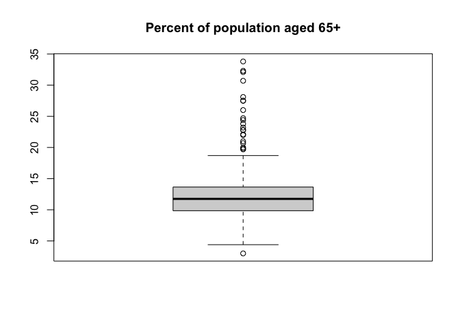

Untitled
================
Jiacheng Wu
12/6/2021

``` r
crime_df = read.csv("cdi.csv")
```

``` r
crime_df_1 = 
  dplyr::select(crime_df, -id, -cty, -state)
```

``` r
pairs(crime_df_1)
```

<!-- -->

``` r
corrplot(cor(crime_df_1), type = "upper", diag = FALSE)
```

<!-- -->

``` r
boxplot(crime_df_1$pop, main = "Total population")
```

<!-- -->

``` r
boxplot(crime_df_1$pop18, main = "Percent of population aged 18-34")
```

<!-- -->

``` r
boxplot(crime_df_1$pop65, main = "Percent of population aged 65+")
```

<!-- -->

``` r
boxplot(crime_df_1$area, main = "Land area")
```

<!-- -->

``` r
boxplot(crime_df_1$docs, main = "Number of active physicians")
```

<!-- -->

``` r
boxplot(crime_df_1$beds, main = "Number of hospital beds")
```

<!-- -->

``` r
boxplot(crime_df_1$crimes, main = "Total serious crimes")
```

<!-- -->

``` r
boxplot(crime_df_1$hsgrad, main = "Percent high school graduates")
```

<!-- -->

``` r
boxplot(crime_df_1$bagrad, main = "Percent bachelor's degrees")
```

<!-- -->

``` r
boxplot(crime_df_1$poverty, main = "Percent below poverty level")
```

<!-- -->

``` r
boxplot(crime_df_1$unemp, main = "Percent unemployment")
```

<!-- -->

``` r
boxplot(crime_df_1$pcincome, main = "Per capita income")
```

<!-- -->

``` r
boxplot(crime_df_1$totalinc, main = "Total personal income")
```

<!-- -->

``` r
boxplot(crime_df_1$region, main = "Geographical region")
```

<!-- -->

``` r
mult.fit = lm(crimes ~ ., data = crime_df_1)
summary(mult.fit)
```

    ## 
    ## Call:
    ## lm(formula = crimes ~ ., data = crime_df_1)
    ## 
    ## Residuals:
    ##    Min     1Q Median     3Q    Max 
    ## -74484  -5753    326   5069 407568 
    ## 
    ## Coefficients:
    ##               Estimate Std. Error t value Pr(>|t|)    
    ## (Intercept) -5.093e+04  3.534e+04  -1.441 0.150362    
    ## area        -3.054e+00  8.485e-01  -3.599 0.000357 ***
    ## pop          2.343e-01  2.027e-02  11.560  < 2e-16 ***
    ## pop18        2.211e+02  4.247e+02   0.521 0.602962    
    ## pop65        3.212e+01  3.806e+02   0.084 0.932790    
    ## docs        -5.189e+00  3.150e+00  -1.647 0.100229    
    ## beds         3.404e+00  2.280e+00   1.493 0.136294    
    ## hsgrad      -2.656e+02  3.218e+02  -0.825 0.409688    
    ## bagrad       1.409e+02  3.735e+02   0.377 0.706154    
    ## poverty      1.143e+03  4.881e+02   2.341 0.019693 *  
    ## unemp       -1.597e+02  6.580e+02  -0.243 0.808403    
    ## pcincome     2.335e+00  6.993e-01   3.339 0.000913 ***
    ## totalinc    -7.070e+00  9.459e-01  -7.475 4.44e-13 ***
    ## region       1.457e+03  1.319e+03   1.104 0.270214    
    ## ---
    ## Signif. codes:  0 '***' 0.001 '**' 0.01 '*' 0.05 '.' 0.1 ' ' 1
    ## 
    ## Residual standard error: 23370 on 426 degrees of freedom
    ## Multiple R-squared:  0.8438, Adjusted R-squared:  0.839 
    ## F-statistic:   177 on 13 and 426 DF,  p-value: < 2.2e-16
